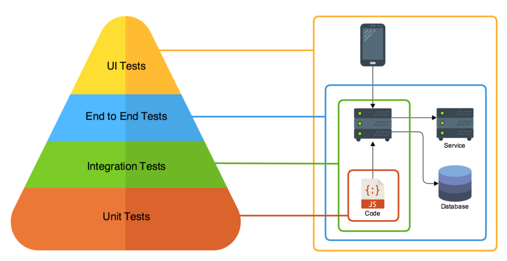
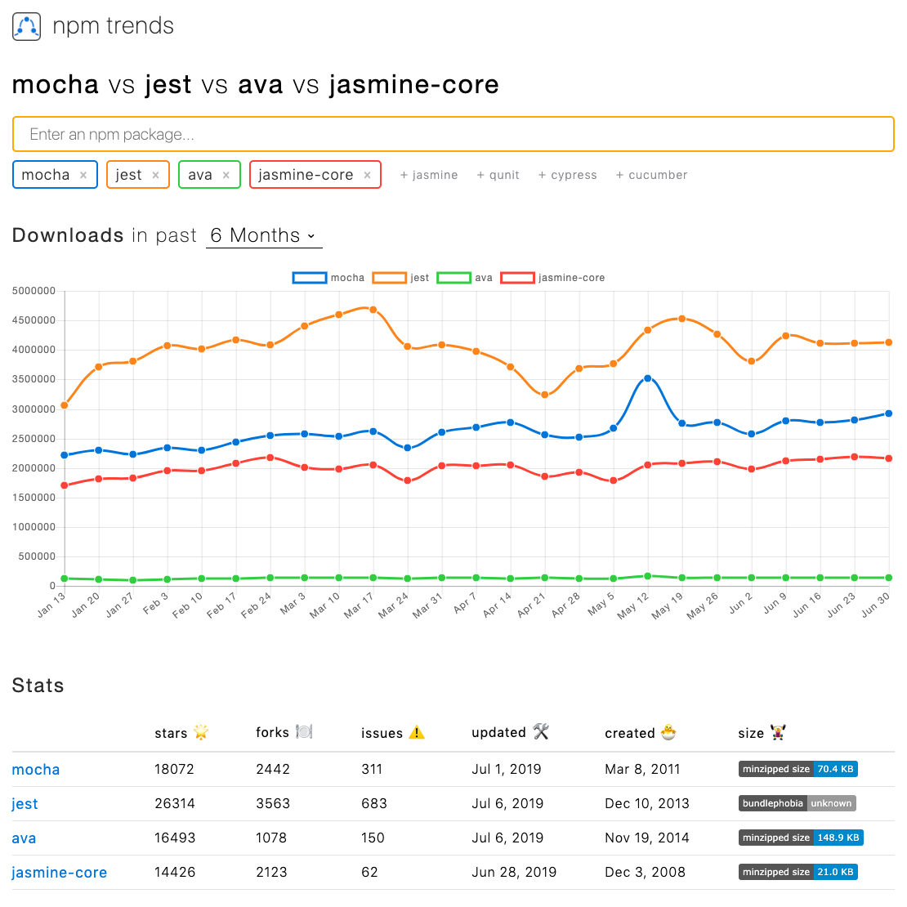
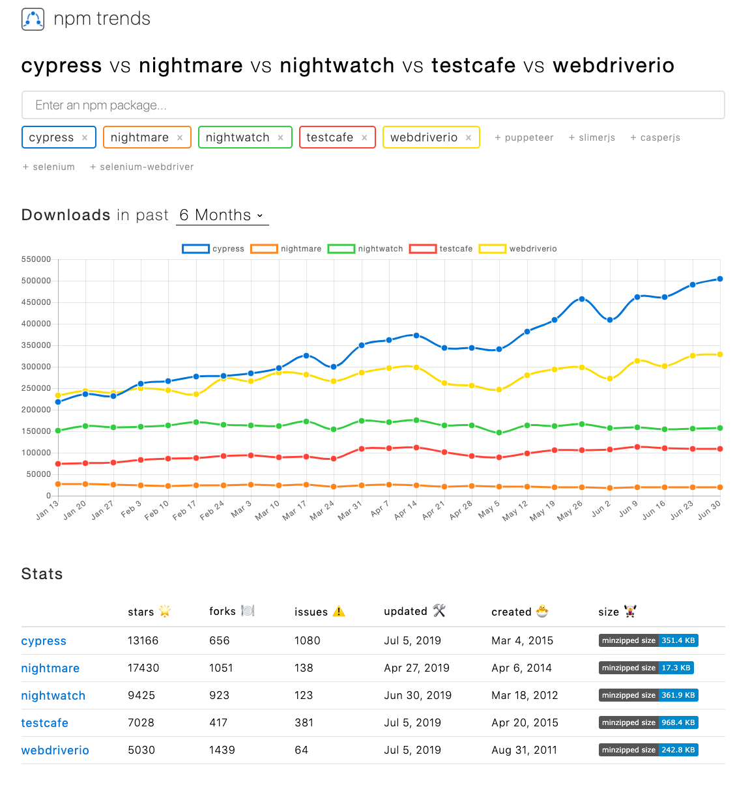
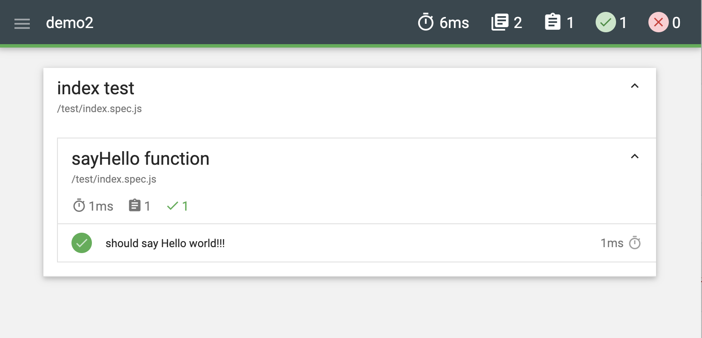
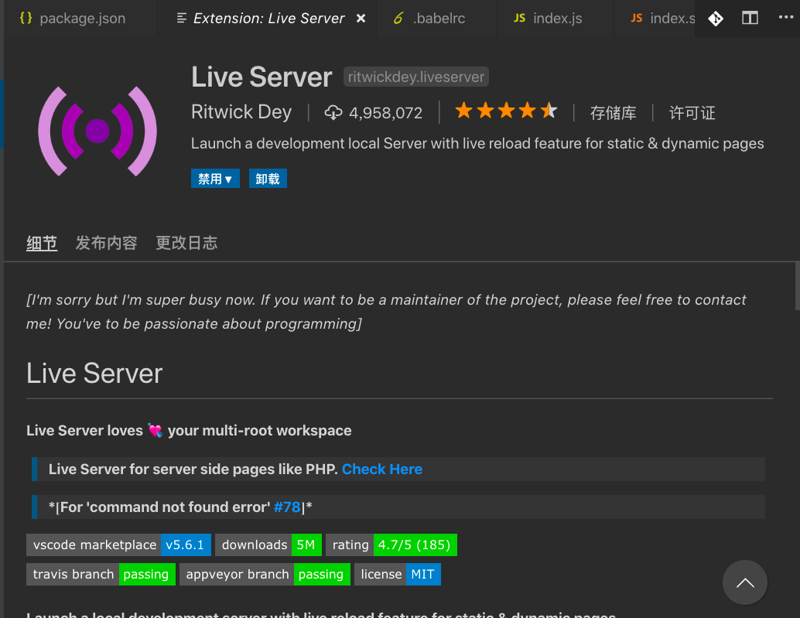
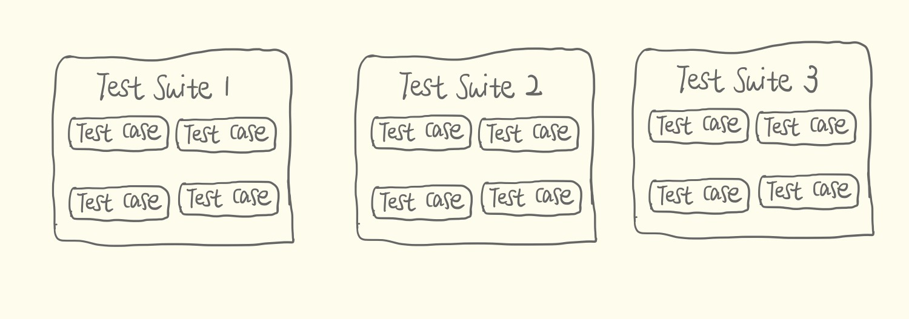
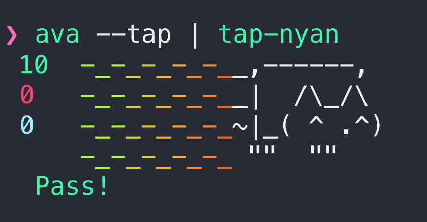
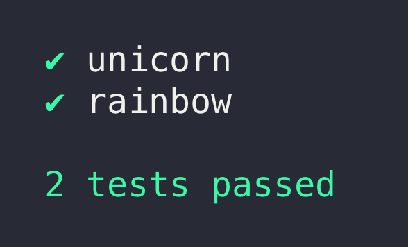
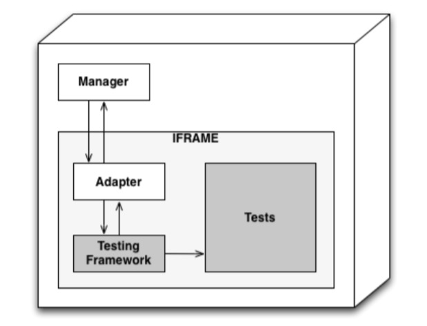

# 自动化测试

## 介绍

在前端界，浏览器兼容性是让工程师们头疼的问题，对于经验丰富的人来说，很清楚浏览器有哪些坑，但是对于大部分程序员，最可怕的是代码明明在这个浏览器运行得很好，但是到了另一个浏览器中就不能正常运行了。对于这部分的程序员，保障代码能正常运行的方法便是能尽早发现问题，然后将其解决。


**为什么需要自动化测试？**

项目经过不断的开发，最终肯定会趋于稳定，在**适当的时机下**引入自动化测试能及早发现问题，**保证产品的质量**。

测试作为完整的开发流程中最后的一环，是保证产品质量重要的一环。而前端测试一般在产品开发流程中属于偏后的环节，在整个开发架构中属于较高层次，前端测试更加偏向于GUI的特性，因此前端的测试难度很大。

测试的目的：

- 有利于写出高质量的代码，尽早发现问题
- 有利于代码的扩展
- 有利于代码的维护


**本课程的学习路径：**

- 学习基础的概念，清晰测试不同的应用场景
- 学习不同的前端测试工具，了解如何进行选择
- 在项目中进行实践


**本课程的主要内容：**

- 介绍测试框架的分类
- 单元测试工具介绍：Mocha，Jest，AVA，Karma
- E2E测试工具介绍：Nightmare


**本课程的学习准备：**

- IDE vscode，node  LTS
- 包管理工具：yarn, cnpm


## 前端自动化测试

测试是一个庞大的主题，包括各种分类的测试，诸如黑盒测试/白盒测试、单元测试/集成测试/端到端测试等。通常程序员在测试自己的代码的时候用得最多的便是单元测试，但是因为测试也是需要代价，很多人是不喜欢写测试的，甚至是一点都不写。

那么是什么原因让大家不愿意写呢？

1. 不熟悉
2. 浪费时间
3. 知识不成体系
4. 团队氛围
5. 缺少实践

我们要从基础的东西学起，打消对测试的恐惧。


### 测试的分类

在多浏览器的自动化测试，我们多半是进行端到端的测试工作，一小部分是大粒度的单元测试。端到端测试测试模拟用户的行为。在 Web 应用程序中，他们会启动服务器，打开浏览器，模拟用户的行为进行点击、输入、提交等动作，断言浏览器中发生了特定的事情或者是得到了期待的结果，从而让我们相信功能可以正常的运行。

而单元测试根据代码单元的公共 API 运行它们。这些测试需要创建一个类的实例，使用特定的输入调用它的方法，断言被调用的方法达到了预期的效果。在下文中我们会看到这两种测试的实践，当然有时候区分度并不大，可能无法明显地区分哪些是端对端测试哪些是单元测试，有时候他们是混合起来的，不过只要记住我们的目标是保证功能可以正常运行救足够了。

按照软件工程自底而上的概念，前端测试一般分为单元测试（Unit Testing ）、集成测试（Integration Testing）和端到端测试（E2E Testing）。从下面的图可以看出，从底向上测试的复杂度将不断提高，另一方面测试的收益反而不断降低的。



> 关于软件测试分类，可见[软件测试的分类](#软件测试的分类)


### 测试工具对比

在进行项目实践前，很重要的一项工作是选择合适的技术栈。好比在前端开发时应该选择 React，Vue 还是 Angular 作为框架一样，前端的测试工作也需要选择一套技术栈。很多时候大家在制定技术栈时容易走偏，在选择技术框架时不是选择最合适的框架，而是选择最热门的框架。当然一定程度上热门的框架能反应其受欢迎程度，可能是因为其出众的优点，如较高的开发效率、高效的渲染特性或者是活跃的社区。在前端开发中，很容易有这样的感受，就是只要半个月没有关注业界的最新动态，就感觉恍若隔世，新的解决方案层出不穷，让人喘不过气。

经过几年的前端洗礼之后，就已经过了慌乱的年纪，再也不会盲目地追寻新技术，而转向关注技术背后解决的痛点，原理等。


#### 如何选择测试框架

测试框架基本上都做了一件事儿：

- 描述你要测试的东西
- 对其进行测试
- 判断是否符合预期


选择框架会考虑下面的点：

- 测试框架是否有简明的语法与文档。

  Mocha、Jasmine、Jest、AVA、Karma、Nightmare

- 断言(Assertions)：用于判断结果是否符合预期。有些框架需要单独的断言库。

  Should.js、chai、expect.js等等，断言库提供了很多语义化的方法来对值做各种各样的判断。当然也可以不用断言库，Node.js中也可以直接使用原生assert库。

- 适合 TDD / BDD：是否适合 测试驱动型 / 行为驱动型 的测试风格。

  > BDD(Bebavior Driven Developement，行为驱动测试)和TDD(Testing Driven Developement，测试驱动开发)

  BDD和TDD均有各自的适用场景，BDD一般更偏向于系统功能和业务逻辑的自动化测试设计，而TDD在快速开发并测试功能模块的过程中则更加高效，以快速完成开发为目的。下面我们看下BDD和TDD具体的特点：

  BDD的特点：

  - 从业务逻辑的角度定义具体的输入与预期输出，以及可衡量的目标；
  - 尽可能覆盖所有的测试用例情况；
  - 描述一系列可执行的行为，根据业务的分析来定义预期输出。例如，expect, should, assert；
  - 设定关键的测试通过节点输出提示，便于测试人员理解；
  - 最大程度的交付出符合用户期望的产品，避免输出不一致带来的问题。

  TDD的特点：

  - 需求分析，快速编写对应的输入输出测试脚本；
  - **仅在自动测试失败时才编写新代码**。
  - 重构去除不必要的依赖关系，然后重复测试，最终让程序符合所有要求。

- 异步测试：有些框架对异步测试支持良好。

- 使用的语言：大部分 js 测试框架使用 js。

- 用于特定目的：每个框架可能会擅长处理不同的问题。

  是要测试单个功能、单个组件、还是集成化测试？

  是要测试GUI逻辑、交互？

  是要测试非功能性指标？兼容性？

- 社区是否活跃。


#### 测试工具的类型

测试工具可分为以下功能。有些只为我们提供了一种功能，有些功能为我们提供了一种组合。

为了实现最灵活的集合功能，通常使用多种工具的组合。

- 提供UI界面或者CLI工具：（[Karma](https://karma-runner.github.io/)，[Jasmine](http://jasmine.github.io/)，[Jest](https://facebook.github.io/jest/)，[TestCafe](https://github.com/DevExpress/testcafe)，[Cypress](https://www.cypress.io/)）

  **CLI工具**会给出一系列测试，以及运行这些测试所需的各种配置和脚手架（运行什么浏览器，使用什么babel插件，如何格式化输出等）

- 提供测试框架（形成文件目录）：([Mocha](https://mochajs.org/), [Jasmine](http://jasmine.github.io/), [Jest](https://facebook.github.io/jest/), [Cucumber](https://github.com/cucumber/cucumber-js), [TestCafe](https://github.com/DevExpress/testcafe), [Cypress](https://www.cypress.io/))

- 提供断言：（[Chai](http://chaijs.com/)，[Jasmine](http://jasmine.github.io/)，[Jest](https://facebook.github.io/jest/)，[Unexpected](http://unexpected.js.org/)，[TestCafe](https://github.com/DevExpress/testcafe)，[Cypress](https://www.cypress.io/)）

  **断言函数**检查测试返回的结果是否符合预期

- 生成，展示测试结果（[Mocha](https://mochajs.org/)，[Jasmine](http://jasmine.github.io/)，[Jest](https://facebook.github.io/jest/)，[Karma](https://karma-runner.github.io/)，[TestCafe](https://github.com/DevExpress/testcafe)，[Cypress](https://www.cypress.io/)）

- 快照测试（[Jest](https://facebook.github.io/jest/)，[Ava](https://github.com/avajs/ava)）

  快照测试(snapshot testing)，测试 UI 或数据结构是否和之前完全一致，通常 UI 测试不在单元测试中

- 提供仿真（[Sinon](http://sinonjs.org/)，[Jasmine](http://jasmine.github.io/)，[enzyme](http://airbnb.io/enzyme/docs/api/)，[Jest](https://facebook.github.io/jest/)，[testdouble](https://testdouble.com/)）

  仿真(mocks, spies, and stubs)：获取方法的调用信息，模拟方法，模块，甚至服务器

- 生成测试覆盖率报告 ([Istanbul](https://gotwarlost.github.io/istanbul/), [Jest](https://facebook.github.io/jest/), [Blanket](http://blanketjs.org/))

- 提供类浏览器环境([Nightwatch](http://nightwatchjs.org/), [Nightmare](http://www.nightmarejs.org/), [Phantom](http://phantomjs.org/)**,** [Puppeteer](https://github.com/GoogleChrome/puppeteer), [TestCafe](https://github.com/DevExpress/testcafe), [Cypress](https://www.cypress.io/))

- 可视化回归工具([Applitools](https://applitools.com/), [Percy](https://percy.io/), [Wraith](http://bbc-news.github.io/wraith/), [WebdriverCSS](https://github.com/webdriverio-boneyard/webdrivercss))


#### 单元测试类工具

npm trends: [点击链接](https://www.npmtrends.com/mocha-vs-jest-vs-ava-vs-jasmine-core)



**Karma**

Karma是一个Runner（即运行环境），具体详细的介绍见 [后面的章节Karma](#测试环境&帮手Karma)

> A test runner is the library or tool that picks up an assembly (or a source code directory) that contains unit tests, and a bunch of settings, and then executes them and writes the test results to the console or log files.
> there are many runners for different languages. See Nunit and MSTest for C#, or Junit for Java.


karma 设计目标主要有下面四点：

> 高效
> 扩展性
> 运行在真实设备
> 无缝的使用流程

karma 是一个典型的 C/S 程序，包含 client 和 server ，通讯方式基于 Http ，通常情况下，客户端和服务端基本都运行在开发者本地机器上。

一个服务端实例对应一个项目，假如想同时运行多个项目，得同时开启多个服务端实例。

Karma 的**优点**是能通过插件和配置的方式集成大部分的主流的测试框架和前端库，能方便的一次在多浏览器环境执行测试用例，并集成了测试覆盖率生成功能，生成页面形式覆盖率报告并能导出不同形式的覆盖率报告数据。

它的**缺点**是，对测试页面环境的搭建和资源文件的加载不是常见的形式，最开始搭建环境时会有很多跟预期不一致的情况，配置不直观。


**Jasmine**

Jasmine 带有 assertions(断言)，spies (用来模拟函数的执行环境)和 mocks (mock 工具)，Jasmine 初始化设置简单，同时，如果你需要一些单元功能的时候你仍然可以加一些库进来。


**Mocha**

Mocha 是一个灵活的库，提供给开发者的只有一个基础测试结构。然后，其它功能性的功能如 assertions， spies和mocks，这些功能**需要引用添加其它库**/插件来完成。


**Jest**

被 Facebook 和各种 React 应用推荐和使用，Jest 得到了很好的支持。Jest 也被发现是一个非常快速的测试库在平行测试报告中。

对于小型项目来说你可能在开始的时候不用过多担心，而性能的提高，对于希望全天持续部署的大型应用 app 来说是非常之好的。

而开发人员主要是用 Jest 去测试 React 应用，Jest 可以很容易地集成到其它应用程序中充许你使用更独特的特性在其它地方

快照测试是一个非常好用的工具，去确保你的应用 UI 不会有超出预期的错误，在产品发布替换的期间发生。虽然大部分功能，专门设计都是使用在 React 上。

Jest 有着很广阔的 API 。


**AVA**

AVA 它的优势是 JavaScript 的异步特性和并发运行测试.

利用了 JavaScript 的异步特性优势，优化了在部署的时间等待

保留了简单的 API 为你提供你所需要的功能。

如果搭配 mocking 来使用它会显得更加友好，但是必须安装一个单独的库。


#### E2E测试类工具

npm trends: [点击链接](https://www.npmtrends.com/cypress-vs-nightmare-vs-nightwatch-vs-testcafe-vs-webdriverio)




### 最佳实践

测试有很多好处，但不代表一上来就要写出100%场景覆盖的测试用例。

**最佳的实践：基于投入产出比来做测试**

由于维护测试用例也是一大笔开销（毕竟没有多少测试会专门帮前端写业务测试用例，而前端使用的流程自动化工具更是没有测试参与了）。

对于像基础组件、基础模型之类的不常变更且复用较多的部分，可以考虑去写测试用例来保证质量。个

先写少量的测试用例覆盖到80%+的场景，保证覆盖主要使用流程。

一些极端场景出现的bug可以在迭代中形成测试用例沉淀，场景覆盖也将逐渐趋近100%。

但对于迭代较快的业务逻辑以及生存时间不长的活动页面之类的就别花时间写测试用例了，维护测试用例的时间大了去了，成本太高。


大型项目，可以使用Jest快速形成配置并且开始单元测试。

需要测试快照，则可以选择Jest或者Ava。

对于配置性要求高，对测试框架性能有要求的可以选择mocha。

对模拟还原浏览器业务操作有很大的需求的，可以选择nightmare


配合CI工具完成自动化测试、测试覆盖率、测试结果推送。


## 喜欢简单，选择Mocha

[`Mocha`](https://mochajs.org/)（发音"摩卡"）诞生于2011年，是现在最流行的JavaScript测试框架之一，在浏览器和Node环境都可以使用。所谓"测试框架"，就是运行测试的工具。通过它，可以为JavaScript应用添加测试，从而保证代码的质量。


### 安装

全局安装Mocha

```bash
npm install -g mocha
```

项目中也安装Mocha

```bash
npm install --save-dev mocha
```

在package.json中加入下面脚本：

```bash
"scripts": {
    "test": "mocha"
}
```

Chai 是一个针对 Node.js 和浏览器的行为驱动测试和测试驱动测试的**断言库**，可与任何 JavaScript 测试框架集成。它是Mocha的好帮手~~

```bash
npm install --save-dev chai
```

在package.json中加入下面脚本：

```json
"scripts": {
    "test": "mocha"
}
```

### 关于断言

`expect`断言的优点是很接近自然语言，下面是一些例子。

```js
// 相等或不相等
expect(4 + 5).to.be.equal(9);
expect(4 + 5).to.be.not.equal(10);
expect(foo).to.be.deep.equal({ bar: 'baz' });

// 布尔值为true
expect('everthing').to.be.ok;
expect(false).to.not.be.ok;

// typeof
expect('test').to.be.a('string');
expect({ foo: 'bar' }).to.be.an('object');
expect(foo).to.be.an.instanceof(Foo);

// include
expect([1,2,3]).to.include(2);
expect('foobar').to.contain('foo');
expect({ foo: 'bar', hello: 'universe' }).to.include.keys('foo');

// empty
expect([]).to.be.empty;
expect('').to.be.empty;
expect({}).to.be.empty;

// match
expect('foobar').to.match(/^foo/);
```

两种使用方式：

```js
// commonjs
const expect = require('chai').expect

// es6
import { expect } from 'chai'
```


### 测试案例

其中index.js为我们的被测试代码：

```js
/**
 * 加法函数
 * @param {第一个数} a 
 * @param {第二个数} b 
 */
function addNum(a,b){
    return a+b;
}
module.exports=addNum;
```

新建测试脚本`test/demo.js`

```js
const expect = require('chai').expect;
const addNum = require('../src/index')

describe('测试index.js', function() {
  describe('测试addNum函数', function() {
    it('两数相加结果为两个数字的和', function() {
      expect(addNum(1,2)).to.be.equal(3);
      // 以上语法为chai的expect语法，它还有should语法和asset语法。
    });
  });
});


// 等价的意思
var addNum=require('../src/index')

describe('测试index.js', function() {
  describe('测试addNum函数', function() {
    it('两数相加结果为两个数字的和', function() {
       if(addNum(1,2)!==3){
         throw new Error("两数相加结果不为两个数字的和")；
       }
    });
  });
});
```


### Mocha测试命令

如果想测试单一的测试js，可以用：

```bash
mocha test/index.test.js
```

或者多个js

```bash
mocha test/index.test.js test/add.test.js
```

当然也可以用通配符测试某个文件夹下所有的js和jsx：

```bash
# node 通配符
mocha 'test/some/*.@(js|jsx)'

# shell 通配符
mocha test/unit/*.js

mocha spec/{my,awesome}.js
```


### ES6语法支持

在上面我们用的并非是ES6的语法，那么让我们把其中的代码都改为ES6的语法。
 其中index.js为：

```js
/**
 * 加法函数
 * @param {第一个数} a 
 * @param {第二个数} b 
 */
function addNum(a, b) {
  return a + b
}

export {
  addNum
} 
```

而index.test.js为：

```js
import { expect } from 'chai'
import { addNum } from '../src/index'

describe('测试index.js', function () {
  describe('测试addNum函数', function () {
    it('两个参数相加结果为两个数字的和', function () {
      expect(addNum(1, 2)).to.be.equal(3);
    })
    it('两个参数相加结果不为和以外的数', function () {
      expect(addNum(1, 2)).to.be.not.equal(4);
    })
  })
})
```

此时直接运行mocha肯定是不行的，我们现需要安装一下babel：

```bash
npm install --save-dev @babel/cli @babel/core @babel/node @babel/register @babel/preset-env chai mocha nodemon
```

然后，在项目目录下面，新建一个.babelrc文件：

```json
{
  "presets": ["@babel/preset-env"]
}
```

接着讲package.json中的脚本改为：

```json
"scripts": {
  "test": "mocha --require @babel/register"
},
```

命令变得更加简单了


### 更多用法

#### 超时

```bash
  --timeout, -t, --timeouts  Specify test timeout threshold (in milliseconds)
                                                        [number] [default: 2000]
```

官方默认的超时是2000毫秒，即2s。

有三种方式来修改超时：

`--no-timeout`参数或者`debug`模式中，全局禁用了超时；

`--timeout`后面接时间（毫秒），全局修改了本次执行测试用例的超时时间；

在测试用例里面，使用`this.timeout`方法：

```js
it('should take less than 500ms', function(done) {
  this.timeout(500);
  setTimeout(done, 300);
});
```

在[钩子方法](#钩子方法（生命周期函数）)里面使用：

```js
describe('a suite of tests', function() {
  beforeEach(function(done) {
    this.timeout(3000); // A very long environment setup.
    setTimeout(done, 2500);
  });
});
```

> 同样，可以使用``this.timeout(0)` `去禁用超时。

#### 钩子方法（生命周期函数）

Mocha在describe块之中，提供测试用例的四个钩子：before()、after()、beforeEach()和afterEach()。它们会在指定时间执行。

```js
describe('测试index.js',()=> {
  before(()=>console.info("在本区块的所有测试用例之前执行"))

  after(()=>console.info("在本区块的所有测试用例之后执行"))

  beforeEach(()=>console.info("在本区块的每个测试用例之前执行"))

  afterEach(()=>console.info("在本区块的每个测试用例之后执行"))

  describe('测试addNum函数', ()=> {
    it('两数相加结果为两个数字的和', ()=> {
      assert.equal(addNum(1,2),3)
    })
  })
})
```

#### 异步测试

Mocha本身是支持异步测试的。只需要为`describe`回调函数添加一个`done`参数， 成功时调用`done()`，失败时调用`done(err)`。例如：

```js
var expect = require('chai').expect;
describe('db', function() {
    it('#get', function(done) {
        db.get('foo', function(err, foo){
            if(err) done(err);        
            expect(foo).to.equal('bar');
            done();
        });
    });
});
```

- 如果未调用`done`函数，Mocha会一直等待直到超时。
- 如果未添加`done`参数，Mocha会直接返回成功，不会捕获到异步的断言失败。例如：

```js
it('#get', function(){
    setTimeout(function(){
        expect(1).to.equal(2);
    }, 100);
});
```

运行上述测试[Mocha](https://mochajs.org/)总会提示Passing。

> Mocha怎么知道是否要等待异步断言呢？因为JavaScript中的[Function](https://developer.mozilla.org/zh-CN/docs/Web/JavaScript/Reference/Global_Objects/Function)有一个`length`属性， 通过它可以获得该函数的形参个数。Mocha通过传入回调的`length`来判断是否需要等待。


或者，`done()`您可以返回[Promise](https://developer.mozilla.org/en-US/docs/Web/JavaScript/Reference/Global_Objects/Promise)，而不是使用回调。如果您正在测试的API返回promises而不是回调，可以这样进行使用：

```js
beforeEach(function() {
  return db.clear().then(function() {
    return db.save([tobi, loki, jane]);
  });
});

describe('#find()', function() {
  it('respond with matching records', function() {
    return db.find({type: 'User'}).should.eventually.have.length(3);
  });
});
```


同样，可以使用[async / await](https://developer.mozilla.org/en/docs/Web/JavaScript/Reference/Statements/async_function)，您还可以编写如下的异步测试：

```js
beforeEach(async function() {
  await db.clear();
  await db.save([tobi, loki, jane]);
});

describe('#find()', function() {
  it('responds with matching records', async function() {
    const users = await db.find({type: 'User'});
    users.should.have.length(3);
  });
});
```

> 需要Babel支持~~~


### 示例项目

#### 创建项目&安装依赖

```bash
// 初始化一个nodejs项目
npm init -y

// 安装依赖
npm install --save-dev @babel/cli @babel/core @babel/node @babel/register @babel/preset-env chai mocha nodemon
```

形成package.json

```json
{
  "name": "projects",
  "version": "1.0.0",
  "description": "",
  "main": "index.js",
  "scripts": {
  },
  "keywords": [],
  "author": "",
  "license": "ISC",
  "devDependencies": {
    "@babel/cli": "^7.5.0",
    "@babel/core": "^7.5.0",
    "@babel/node": "^7.5.0",
    "@babel/preset-env": "^7.5.0",
    "@babel/register": "^7.4.4",
    "chai": "^4.2.0",
    "mocha": "^6.1.4",
    "nodemon": "^1.19.1"
  }
}
```


#### 测试过程

新建一个待测试的方法`./src/index.js`

```js
const sayHello = () => "Hello world!!!"

console.log(sayHello())

// ES6语法
export default sayHello
```

测试脚本`./test/index.spec.js`

```js
import { expect } from "chai"
import sayHello from "../src/index"

describe("index test", () => {
  describe("sayHello function", () => {
    it("should say Hello guys!", () => {

      const str = sayHello();
      expect(str).to.equal("Hello guys!")
    })
  })
})
```

`package.json`中的脚本：

```json
  "scripts": {
    // "start": "nodemon ./src/index.js",  // 针对ES5语法
    "start:babel": "nodemon --exec babel-node ./src/index.js",
    "test:watch": "mocha --require @babel/register --watch",
    "test": "mocha --require @babel/register",
    "build": "babel src --out-dir ./dist --source-maps",
    "serve": "node ./dist/index.js",
    "debug": "node --inspect-brk ./dist/index.js"
  },
```

开始测试：`npm run test`

报错了，因为期望的值与实际值不一致。

```bash
Hello world!!!


  index test
    sayHello function
      1) should say Hello guys!


  0 passing (9ms)
  1 failing

  1) index test
       sayHello function
         should say Hello guys!:

      AssertionError: expected 'Hello world!!!' to equal 'Hello guys!'
      + expected - actual

      -Hello world!!!
      +Hello guys!
      
      at Context.equal (test/index.spec.js:9:22)
```

修改测试脚本，或者修改index.js文件：

修改`./test/index.spec.js`

```js
import { expect } from "chai"
import sayHello from "../src/index"

describe("index test", () => {
  describe("sayHello function", () => {
    it("should say Hello world!!!", () => {

      const str = sayHello();
      expect(str).to.equal("Hello world!!!")
    })
  })
})
```

再次测试：

```bash
> mocha --require @babel/register

Hello world!!!


  index test
    sayHello function
      ✓ should say Hello world!!!


  1 passing (6ms)
```


使用`mochawesome`展示你的测试结果：

```bash
npm install --save-dev mochawesome
```

然后在`package.json`的`scripts`中添加如下内容，

```json
{
	"report": "mocha --require @babel/register --reporter mochawesome",
}
```

使用方式：

```bash
npm run report
```

形成出来的报告在浏览器中打开：




在Vscode中可以安装Live Server这个插件快速打开：




## 开箱即用Jest

Jest是由Facebook发布的开源的、基于[Jasmine](http://jasmine.github.io/)的JavaScript单元测试框架。Jest源于Facebook的构想，用于快速、可靠地测试Web聊天应用。它吸引了公司内部的兴趣，Facebook的一名软件工程师Jeff Morrison半年前又重拾这个项目，改善它的性能，并将其开源。Jest的目标是减少开始测试一个项目所要花费的时间和认知负荷，因此它提供了大部分你需要的现成工具：快速的命令行接口、Mock工具集以及它的自动模块Mock系统。此外，如果你在寻找隔离工具例如Mock库，大部分其它工具将让你在测试中（甚至经常在你的主代码中）写一些不尽如人意的样板代码，以使其生效。Jest与Jasmine框架的区别是在后者之上增加了一些层。最值得注意的是，运行测试时，Jest会自动模拟依赖。Jest自动为每个依赖的模块生成Mock，并默认提供这些Mock，这样就可以很容易地隔离模块的依赖。


Jest支持Babel，我们将很轻松的使用ES6的高级语法

Jest支持webpack，非常方便的使用它来管理我们的项目

Jest支持TypeScript，书写测试用例更加严谨


1. 简化API

   Jest既简单又强大，内置支持以下功能：

   - 灵活的配置：比如，可以用文件名通配符来检测测试文件。
   - 测试的事前步骤(Setup)和事后步骤(Teardown)，同时也包括测试范围。
   - 匹配表达式(Matchers)：能使用期望`expect`句法来验证不同的内容。
   - 测试异步代码：支持承诺(promise)数据类型和异步等待`async` / `await`功能。
   - 模拟函数：可以修改或监查某个函数的行为。
   - 手动模拟：测试代码时可以忽略模块的依存关系。
   - 虚拟计时：帮助控制时间推移。

2. 性能与隔离

   Jest文档里写道：

   Jest能运用所有的工作部分，并列运行测试，使性能最大化。终端上的信息经过缓冲，最后与测试结果一起打印出来。沙盒中生成的测试文件，以及自动全局状态在每个测试里都会得到重置，这样就不会出现两个测试冲突的情况。

   Mocha用一个进程运行所有的测试，和它比较起来，Jest则完全不同。要在测试之间模拟出隔离效果，我们必须要引入几个测试辅助函数来妥善管理清除工作。这种做法虽然不怎么理想，但99%的情况都可以用，因为测试是按顺序进行的。

3. 沉浸式监控模式

   快速互动式监控模式可以监控到哪些测试文件有过改动，只运行与改动过的文件相关的测试，并且由于优化作用，能迅速放出监控信号。设置起来非常简单，而且还有一些别的选项，可以用文件名或测试名来过滤测试。我们用Mocha时也有监控模式，不过没有那么强大，要运行某个特定的测试文件夹或文件，就不得不自己创造解决方法，而这些功能Jest本身就已经提供了，不用花力气。

4. 代码覆盖率&测试报告

   Jest内置有代码覆盖率报告功能，设置起来易如反掌。可以在整个项目范围里收集代码覆盖率信息，包括未经受测试的文件。

   要使完善Circle CI整合，只需要一个自定义报告功能。有了Jest，用[jest-junit-reporter](https://github.com/michaelleeallen/jest-junit-reporter)就可以做到，其用法和Mocha几乎相同。

5. 快照功能

   快照测试的目的不是要替换现有的单元测试，而是要使之更有价值，让测试更轻松。在某些情况下，某些功能比如React组件功能，有了快照测试意味着无需再做单元测试，但同样这两者不是非此即彼。


### 安装

新建文件夹然后通过npm 命令安装：

```bash
npm install --save-dev jest
```

或者通过yarn来安装：

```bash
yarn add --dev jest
```

然后就可以开始测试了

也可用`npm install -g jest`进行全局安装；并在 package.json 中指定 test 脚本：

```json
{
  "scripts": {
    "test": "jest"
  }
}
```

Jest 的测试脚本名形如`.test.js`，不论 Jest 是全局运行还是通过`npm test`运行，它都会执行当前目录下所有的`*.test.js` 或 `*.spec.js` 文件、完成测试。


ES6语法支持：

1. 安装依赖

```bash
yarn add --dev babel-jest @babel/core @babel/preset-env
```

2. 配置`.babelrc`

```json
{
  "presets": [
    [
      "@babel/preset-env",
      {
        "targets": {
          "node": "current"
        }
      }
    ]
  ]
}
```

接下来就可以使用ES6的语法了~~~

更多高阶的ES6/7/8…语法，可以参见：[babel官网](https://babeljs.io/)

关于Typescript的支持，可以参见 ：[Using Typescript](https://jestjs.io/docs/en/getting-started#using-typescript)


### 举个例子

关于test suite与test case：



describe属于 test suite 的描述，而每个 test 或者 it 则描述了每个 test case。

例如：`math.js`

```js
export const add = (a, b) => a + b;

export const multiple = (a, b) => a * b;
```

测试脚本：`math.test.js`

```js
const math = require('./src/math')

describe("math", () => {
  let a
  let b

  beforeEach(function () {
    a = 2;
    b = 3;
  });

  test("#should return result as a+b", () => {
    // test code
    const result = math.add(a, b)
    expect(result).toEqual(5)
  });

  it("#should return result as a*b", () => {
    //test code
    const result = math.multiple(a, b)
    expect(result).toEqual(6)
  });
});
```


 test suite 可以进行嵌套：

```js
describe("foo", () => {
  describe("bar", () => {
    it("foo bar", () => {
      //test code
    });
  });
});
```


test case 也可以脱离 test suite 独立运行：

```js
// hello.js
module.exports = () => 'Hello world'

// hello.test.js
let hello = require('hello.js')

test('should get "Hello world"', () => {
    expect(hello()).toBe('Hello world') // 测试成功
// expect(hello()).toBe('Hello') // 测试失败
})
```


### Mock与Spy

**mock**测试就是在测试过程中，对于某些不容易构造或者不容易获取的对象，用一个虚拟的对象来创建以便测试的测试方法。

Mock 是单元测试中经常使用的一种技术。单元测试，顾名思义测试的重点是某个具体单元。但是在实际代码中，代码与代码之间，模块与模块之间总是会存在着相互引用。这个时候，剥离出这种单元的依赖，让测试更加独立，使用到的技术就是 Mock。

**为什么要使用Mock函数？**

在项目中，一个模块的方法内常常会去调用另外一个模块的方法。在单元测试中，我们可能并不需要关心内部调用的方法的执行过程和结果，只想知道它是否被正确调用即可，甚至会指定该函数的返回值。此时，使用Mock函数是十分有必要。

Mock函数提供的以下三种特性，在我们写测试代码时十分有用：

- 捕获函数调用情况
- 设置函数返回值
- 改变函数的内部实现


举个例子：

```js
// math.js
export const getFooResult = () => {
  // foo logic here
};
export const getBarResult = () => {
  // bar logic here
};

// caculate.js
import { getFooResult, getBarResult } from "./math";

export const getFooBarResult = () => getFooResult() + getBarResult();
```

此时，getFooResult() 和 getBarResult() 就是 getFooBarResult 这个函数的依赖。如果我们关注的点是 getFooBarResult 这个函数，我们就应该把 getFooResult 和 getBarResult Mock 掉，剥离这种依赖。下面是一个使用 Jest 进行 Mock 的例子。


`jest.fn()`是创建Mock函数最简单的方式，如果没有定义函数内部的实现，`jest.fn()`会返回`undefined`作为返回值。

```javascript
test('测试jest.fn()调用', () => {
  let mockFn = jest.fn();
  let result = mockFn(1, 2, 3);

  // 断言mockFn的执行后返回undefined
  expect(result).toBeUndefined();
  // 断言mockFn被调用
  expect(mockFn).toBeCalled();
  // 断言mockFn被调用了一次
  expect(mockFn).toBeCalledTimes(1);
  // 断言mockFn传入的参数为1, 2, 3
  expect(mockFn).toHaveBeenCalledWith(1, 2, 3);
})
```


**情景一：设置函数 的返回值**

```js
// calculate.test.js
import { getFooBarResult } from "./calculate";
import * as fooBar from './math';

test('getResult should return result getFooResult() + getBarResult()', () => {
  // mock add方法和multiple方法
  fooBar.getFooBarResult = jest.fn(() => 10);
  fooBar.getBarResult = jest.fn(() => 5);

  const result = getFooBarResult();

  expect(result).toEqual(15);
});
```

Mock其实就是一种Spies，在Jest中使用spies来“spy”(窥探)一个函数的行为。

[Jest文档](https://jestjs.io/docs/en/mock-function-api.html#content)对于spies的解释:

> Mock函数也称为“spies”，因为它们让你窥探一些由其他代码间接调用的函数的行为，而不仅仅是测试输出。你可以通过使用 `jest.fn()` 创建一个mock函数。

简单来说，一个spy是另一个内置的能够记录对其调用细节的函数：调用它的次数，使用什么参数。

```js
// calculate.test.js
import { getFooBarResult } from "./calculate";
import * as fooBar from './math';

test('getResult should return result getFooResult() + getBarResult()', () => {
  // mock add方法和multiple方法
  fooBar.getFooResult = jest.fn(() => 10);
  fooBar.getBarResult = jest.fn(() => 5);

  const result = getFooBarResult();

  // 监控getFooResult和getBarResult的调用情况.
  expect(fooBar.getFooResult).toHaveBeenCalled();
  expect(fooBar.getBarResult).toHaveBeenCalled();
});
```


**情景二：捕获函数调用情况**

```js
// bot method
const bot = {
  sayHello: name => {
    console.log(`Hello ${name}!`);
  }
};

// test.js
describe("bot", () => {
  it("should say hello", () => {
    const spy = jest.spyOn(bot, "sayHello");

    bot.sayHello("Michael");

    expect(spy).toHaveBeenCalledWith("Michael");

    spy.mockRestore();
  });
});
```

我们通过 `jest.spyOn` 创建了一个监听 `bot` 对象的 `sayHello` 方法的 spy。它就像间谍一样监听了所有对 `bot#sayHello` 方法的调用。由于创建 spy 时，Jest 实际上修改了 `bot` 对象的 `sayHello` 属性，所以在断言完成后，我们还要通过 `mockRestore` 来恢复 `bot` 对象原本的 `sayHello`方法。

Jest的[spyOn介绍](https://jestjs.io/docs/en/jest-object#jestspyonobject-methodname)


**情景三：修改函数的内容实现**

```js
const bot = {
  sayHello: name => {
    console.log(`Hello ${name}!`);
  }
};

describe("bot", () => {
  it("should say hello", () => {
    const spy = jest.spyOn(bot, "sayHello").mockImplementation(name => {
      console.log(`Hello mix ${name}`)
    });

    bot.sayHello("Michael");

    expect(spy).toHaveBeenCalledWith("Michael");

    spy.mockRestore();
  });
});
```


使用spyOn方法，还可以去修改Math.random这样的函数

```js
jest.spyOn(Math, "random").mockImplementation(() => 0.9);
```

举个例子：

```js
// getNum.js
const arr = [1,2,3,4,5,6];

const getNum = index => {
  if (index) {
    return arr[index % 6];
  } else {
    return arr[Math.floor(Math.random() * 6)];
  }
};

// num.test.js
import { getNum } from '../src/getNum'

describe("getNum", () => {
  it("should select numbber based on index if provided", () => {
    expect(getNum(1)).toBe(2);
  });

  it("should select a random number based on Math.random if skuId not available", () => {
    const spy = jest.spyOn(Math, "random").mockImplementation(() => 0.9);

    expect(getNum()).toBe(6);
    expect(spy).toHaveBeenCalled();

    spy.mockRestore();
  });
});
```


### CLI命令

```
➜ npx jest --help
Usage: jest [--config=<pathToConfigFile>] [TestPathPattern]

选项：
  --help, -h                    显示帮助信息                              [布尔]
  --version, -v                 Print the version and exit                [布尔]
  --config, -c                  The path to a jest config file specifying how to
                                find and execute tests. If no rootDir is set in
                                the config, the directory containing the config
                                file is assumed to be the rootDir for the
                                project.This can also be a JSON encoded value
                                which Jest will use as configuration.   [字符串]
  --coverage                    Indicates that test coverage information should
                                be collected and reported in the output.  [布尔] 
  --timers                      Setting this value to fake allows the use of
                                fake timers for functions such as setTimeout.
                                                                        [字符串]
  --verbose                     Display individual test results with the test
                                suite hierarchy.                          [布尔]
  --watch                       Watch files for changes and rerun tests related
                                to changed files. If you want to re-run all
                                tests when a file has changed, use the
                                `--watchAll` option.                      [布尔]
  --watchAll                    Watch files for changes and rerun all tests. If
                                you want to re-run only the tests related to the
                                changed files, use the `--watch` option.  [布尔]
...
```

常见使用：

`--verbose`显示详细的测试信息，包括测试suite和case：

```bash
➜ npx jest --verbose
 PASS  test/mock.test.js
  bot
    ✓ should say hello (7ms)

  console.log test/mock.test.js:10
    Hello mix Michael

 PASS  test/domain.test.js
  getImageDomain
    ✓ should select domain based on skuId if provided (1ms)
    ✓ should select a random domain based on Math.random if skuId not available (1ms)

  console.log test/sayhello.test.js:3
    Hello Michael!

 PASS  test/sayhello.test.js
  bot
    ✓ should say hello (6ms)

 PASS  test/num.test.js
  getNum
    ✓ should select numbber based on index if provided (1ms)
    ✓ should select a random number based on Math.random if skuId not available

 PASS  test/math.test.js
  math
    ✓ #should return result as a+b (1ms)
    ✓ #should return result as a*b (4ms)

Test Suites: 5 passed, 5 total
Tests:       8 passed, 8 total
Snapshots:   0 total
Time:        1.075s
Ran all test suites.
```


`--watch`和`--watchAll`用来监听测试文件的变化 

```bash
Ran all test suites.

Watch Usage
 › Press f to run only failed tests.
 › Press o to only run tests related to changed files.
 › Press p to filter by a filename regex pattern.
 › Press t to filter by a test name regex pattern.
 › Press q to quit watch mode.
 › Press Enter to trigger a test run.
```


`--coverage`用来形成测试覆盖率报告

```bash
-----------|----------|----------|----------|----------|-------------------|
File       |  % Stmts | % Branch |  % Funcs |  % Lines | Uncovered Line #s |
-----------|----------|----------|----------|----------|-------------------|
All files  |      100 |      100 |      100 |      100 |                   |
 getNum.js |      100 |      100 |      100 |      100 |                   |
 math.js   |      100 |      100 |      100 |      100 |                   |
-----------|----------|----------|----------|----------|-------------------|

Test Suites: 5 passed, 5 total
Tests:       8 passed, 8 total
Snapshots:   0 total
Time:        1.497s
```


### Jest在React、Vue项目中的应用

在`create-react-app`中的应用：

安装对应的依赖：

```
npm install react-test-renderer enzyme enzyme-adapter-react-16 
```

[Enzyme](https://github.com/airbnb/enzyme)是一个非常棒的React组件测试测试库。

> Enzyme is a JavaScript Testing utility for React that makes it easier to test your React Components' output. You can also manipulate, traverse, and in some ways simulate runtime given the output.
>
> Enzyme's API is meant to be intuitive and flexible by mimicking jQuery's API for DOM manipulation and traversal

需要注意的两点是：

- 需要配置Adapter，不同的React的Adapter不同

| Enzyme Adapter Package      | React semver compatibility |
| --------------------------- | -------------------------- |
| `enzyme-adapter-react-16`   | `^16.4.0-0`                |
| `enzyme-adapter-react-16.3` | `~16.3.0-0`                |
| `enzyme-adapter-react-16.2` | `~16.2`                    |
| `enzyme-adapter-react-16.1` | `~16.0.0-0 || ~16.1`       |
| `enzyme-adapter-react-15`   | `^15.5.0`                  |
| `enzyme-adapter-react-15.4` | `15.0.0-0 - 15.4.x`        |
| `enzyme-adapter-react-14`   | `^0.14.0`                  |
| `enzyme-adapter-react-13`   | `^0.13.0`                  |

- 需要初始化配置`setUpTests.js`

  官方文档在Package.json中设置jest配置，已经过时，Jest框架最新会默认加载文件`src/setUpTests.js`

- ```react
  import { configure } from 'enzyme';
  import Adapter from 'enzyme-adapter-react-16'
  
  configure({ adapter: new Adapter() })
  ```


在vue工程化项目中：

```json
"devDependencies": {
  "@vue/cli-plugin-unit-jest": "^3.9.0",
  "@vue/test-utils": "1.0.0-beta.29",
  "babel-core": "7.0.0-bridge.0",
  "babel-eslint": "^10.0.1",
  "babel-jest": "^23.6.0",
  "babel-preset-env": "^1.7.0",
},
```

添加如上依赖，

配置scripts:

```js
"scripts": {
  "test": "vue-cli-service test:unit"
},
```

配置`jest.config.js`

```js
module.exports = {
  // 处理vue结尾的文件
  moduleFileExtensions: [
    'js',
    'jsx',
    'json',
    'vue'
  ],
  // es6转义
  transform: {
    '^.+\\.vue$': 'vue-jest',
    '.+\\.(css|styl|less|sass|scss|svg|png|jpg|ttf|woff|woff2)$': 'jest-transform-stub',
    '^.+\\.jsx?$': 'babel-jest'
  },
  transformIgnorePatterns: [
    '/node_modules/'
  ],
  // cli配置了webpack别名
  moduleNameMapper: {
    '^@/(.*)$': '<rootDir>/src/$1'
  },
  snapshotSerializers: [
    'jest-serializer-vue'
  ],
  testMatch: [
    '**/tests/unit/**/*.spec.(js|jsx|ts|tsx)|**/__tests__/*.(js|jsx|ts|tsx)'
  ],
  testURL: 'http://localhost/',
  watchPlugins: [
    'jest-watch-typeahead/filename',
    'jest-watch-typeahead/testname'
  ]
}

```


写一个测试用例：

```

```


## 简约之美AVA

简单的说ava是mocha的替代品：

- es6语法支持更好，对aysnc/await有支持
- 执行效率更高，使用io并发，就必须保证测试的原子性
- 语义上更简单，集众家之长

虽然 JavaScript 是单线程，但在 Node.js 里由于其异步的特性使得 IO 可以并行。AVA 利用这个优点让你的测试可以并发执行，这对于 IO 繁重的测试特别有用。另外，测试文件可以在不同的进程里并行运行，让每一个测试文件可以获得更好的性能和独立的环境。


### AVA特点

- 轻量和高效

- 简单的测试语法

- 并发运行测试

- 强制编写**原子测试**

  一旦开始，就一直运行到结束，中间不会切换到另一个测试

- 没有隐藏的全局变量

- 为每个测试文件隔离环境

- **用 ES2015 编写测试**

- 支持 Promise

- 支持 Generator

- 支持 Async

- 支持 Observable

- 强化断言信息

- 可选的 TAP 输出显示

  

- 简明的堆栈跟踪


### 安装&开始

情景一：

```bash
// 创建一个ava项目
npm init ava
```

形成package.json

```json
{
	"name": "awesome-package", 
	"scripts": {
		"test": "ava"
	},
	"devDependencies": {
		"ava": "^1.0.0"
	}
}
```


情景二：（推荐）

```bash
npm init -y

// npm & cnpm
npm install -D ava

// yarn 
yarn add ava -D
```


测试ava正常安装：

```bash
➜ npx ava --version
2.2.0
```


### 第一个ava测试例子

流程：

1. 引用ava的测试API
2. 执行测试
3. 使用断言


创建`test.js`文件

```js
import test from 'ava';

const testfn = (a, b) => a + b

test('hello ava', t => {
  t.pass();
});

test('my first test', async t => {
  const str = 'hello ava!!!!'
  t.is(str, 'hello ava!!!!')
});

test('add method', async t => {
  const result = testfn(3, 4)
  t.is(result, 7)
});
```

ava自动搜索如下文件结尾的文件：

- `**/test.js`
- `**/test-*.js`
- `**/*.spec.js`
- `**/*.test.js`
- `**/test/**/*.js`
- `**/tests/**/*.js`
- `**/__tests__/**/*.js`


ava中的断言：

```json
.pass([message])
.fail([message])
.assert(value, [message])
.truthy(value, [message])
.falsy(value, [message])
.true(value, [message])
.false(value, [message])
.is(value, expected, [message])
.not(value, expected, [message])
.deepEqual(value, expected, [message])
.notDeepEqual(value, expected, [message])
.deepEqual()。
.throws(fn, [expected, [message]])
.throwsAsync(thrower, [expected, [message]])
.notThrows(fn, [message])
.notThrowsAsync(nonThrower, [message])
.regex(contents, regex, [message])
.notRegex(contents, regex, [message])
.snapshot(expected, [message])
.snapshot(expected, [options], [message])
```


### CLI命令

使用`--help`命令去查看ava支持的cli参数 

```bash
➜ npx ava --help

  Testing can be a drag. AVA helps you get it done.

  Usage
    ava [<file> ...]

  Options
    --watch, -w             Re-run tests when tests and source files change
    --match, -m             Only run tests with matching title (Can be repeated)
    --update-snapshots, -u  Update snapshots
    --fail-fast             Stop after first test failure
    --timeout, -T           Set global timeout (milliseconds or human-readable, e.g. 10s, 2m)
    --serial, -s            Run tests serially
    --concurrency, -c       Max number of test files running at the same time (Default: CPU cores)
    --verbose, -v           Enable verbose output
    --tap, -t               Generate TAP output
    --color                 Force color output
    --no-color              Disable color output
    --reset-cache           Reset AVA's compilation cache and exit
    --config                JavaScript file for AVA to read its config from, instead of using package.json
                            or ava.config.js files

  Examples
    ava
    ava test.js test2.js
    ava test-*.js
    ava test

  The above relies on your shell expanding the glob patterns.
  Without arguments, AVA uses the following patterns:
    **/test.js **/test-*.js **/*.spec.js **/*.test.js **/test/**/*.js **/tests/**/*.js **/__tests__/**/*.js
```


#### 文件匹配

使用`match`指令，匹配对应需要测试的文件：

匹配标题以`foo`：结尾

```
npx ava --match ='* foo'
```

匹配标题以`foo`：

```
npx ava --match ='foo *'
```

匹配标题包含`foo`：

```
npx ava --match ='* foo *'
```

匹配是完全相同 `foo`：

```
npx ava --match ='foo'
```

匹配标题不包含`foo`：

```
npx ava --match ='！* foo *'
```

匹配以下`foo`结尾的标题`bar`：

```
npx ava --match ='foo * bar'
```

匹配`foo`以`bar`：开头或结尾的标题：

```
npx ava --match ='foo *' -  match ='* bar'
```


#### 关于reporter

默认情况下，AVA使用最小的报告：

[](https://github.com/avajs/ava/blob/master/media/mini-reporter.gif)

使用该`--verbose`标志启用详细的报告者。除非启用TAP报告，否则始终在CI环境中使用此选项。

[](https://github.com/avajs/ava/blob/master/media/verbose-reporter.png)


**TAP报告（推荐）**

AVA支持TAP格式，因此与任何TAP报告器兼容。使用该`--tap`标志启用TAP输出。

```bash
$ npx ava --tap | npx tap-nyan
```

[](https://github.com/avajs/ava/blob/master/media/tap-reporter.png)

这里有一些格式：

- [tap-dot](https://github.com/scottcorgan/tap-dot) - Dotted output.
- [tap-spec](https://github.com/scottcorgan/tap-spec) - Mocha-like spec reporter.
- [tap-nyan](https://github.com/calvinmetcalf/tap-nyan) - Nyan cat.
- [tap-min](https://github.com/gummesson/tap-min) - Minimal output.
- [tap-difflet](https://github.com/namuol/tap-difflet) - Minimal output with diffing.
- [tap-diff](https://github.com/axross/tap-diff) - Human-friendly output with diffing.
- [tap-simple](https://github.com/joeybaker/tap-simple) - Simple output.
- [faucet](https://github.com/substack/faucet) - Human-readable summarizer.
- [tap-mocha-reporter](https://github.com/isaacs/tap-mocha-reporter) - Use any of the [Mocha reporters](https://github.com/isaacs/tap-mocha-reporter/tree/master/lib/reporters).
- [tap-summary](https://github.com/zoubin/tap-summary) - Summarized output.
- [tap-pessimist](https://github.com/clux/tap-pessimist) - Only shows failed tests.
- [tap-prettify](https://github.com/toolness/tap-prettify) - Nice readable output with diffing.
- [tap-colorize](https://github.com/substack/tap-colorize) - Colorize the output while preserving machine-readability.
- [tap-bail](https://github.com/juliangruber/tap-bail) - Bail out when the first test fails.
- [tap-notify](https://github.com/axross/tap-notify) - Notifier for macOS, Linux and Windows.
- [tap-json](https://github.com/gummesson/tap-json) - JSON output.
- [ava-tap-json](https://github.com/yovasx2/ava-tap-json) - JSON output with AVA compatibility.
- [tap-xunit](https://github.com/aghassemi/tap-xunit) - xUnit output.
- [tap-teamcity](https://github.com/smockle/tap-teamcity) - Output for TeamCity.


#### 快照功能

ava自动进行项目测试快照，如果文件放置在`test`或者`tests`目录，则快照会放置在`snapshots`目录。如果测试放置在`__test__`目录，则快照放置在`__snapshots__`目录

```bash
ava --update-snapshots
```

可以指定一个固定位置，以便在AVA的`package.json`配置中存储快照文件：

**package.json：**

```json
{
	 "ava"：{
		 "snapshotDir"："自定义目录"
	}
}
```


#### 设置超时

AVA中的超时行为与其他测试框架中的行为不同。AVA在每次测试后重置计时器，如果在指定的超时内没有收到新的测试结果，则强制测试退出。这可用于处理停滞的测试。

*没有默认超时。*

您可以配置使用超时`--timeout` 命令行选项，或配置文件中设置。它们可以以人类可读的方式设置：

```bash
# 10秒
npx ava --timeout = 10s 

# 2分钟
npx ava --timeout = 2m 

# 100毫秒
npx ava --timeout = 100
```

还可以为每个测试单独设置超时。每次进行断言时都会重置这些超时。

```js
test('foo', t => {
	t.timeout(100); // 100 milliseconds
	// Write your assertions here
});
```


### 其他ava设置相关

#### ESLint

如果使用了ESLint，请添加[eslint-plugin-ava](https://github.com/avajs/eslint-plugin-ava)

```json
{
	plugins: [
		"ava"
	]
}
```

#### 异步相关

如果异步操作使用promises，则应返回promise：

```js
test('fetches foo', t => {
	return fetch().then(data => {
		t.is(data, 'foo');
	});
});
```

更好的是，使用`async`/ `await`：

```js
test('fetches foo', async t => {
	const data = await fetch();
	t.is(data, 'foo');
});
```


## 测试环境&帮手Karma

Karma 是一个基于 Node.js 的 JavaScript 测试执行过程管理工具（Test Runner）。该工具可用于测试所有主流 Web 浏览器，也可以集成到 CI（Continuous integration）工具，还可以和其他代码编辑器一起使用。

Karma 会监控配置文件中所指定的每一个文件，每当文件发生改变，它都会向测试服务器发送信号，来通知所有的浏览器再次运行测试代码。此时，浏览器会重新加载源文件，并执行测试代码。其结果会传递回服务器，并以某种形式显示给开发者。

访问浏览器执行结果，可通过以下的方式

- 手工方式 - 通过浏览器
- 自动方式 - 让 karma 来启动对应的浏览器

### 工作原理简介

`karma` 是一个典型的 `C/S` 程序，包含 client 和 server ，通讯方式基于 `Http` ，通常情况下，客户端和服务端基本都运行在开发者本地机器上。

一个服务端实例对应一个项目，假如想同时运行多个项目，得同时开启多个服务端实例。

**Server**

`Server` 是框架的主要组成部分之一，它内部保存了所有的程序运行状态，比如 client 连接，当前运行的单测文件，根据这些数据状态，它提供了下面几个功能， 下图是 server 的结构


- 监听文件
- 与 client 进行通讯
- 向开发者输出测试结果
- 提供 client 端所需的资源文件

**Client**

client 是单测最终运行的地方，类似一个 web app ， 跟 server 端通讯利用 `socket.io`， 执行单测在一个独立的 `iframe` 中。下面是它的结构图



client 和 server 端通讯采用 `socket.io`

- client 端会发送这些消息


- server 端会发送这些消息


### 安装Karma

对于Nodejs版本的要求：

> Karma currently works on Node.js **6.x**, **8.x**, and **10.x**. See [FAQ](https://karma-runner.github.io/4.0/intro/faq.html) for more info.


1. 全局安装

   ```
   $npm install -g karma
   ```

   安装 Karma 命令会到全局的 `node_modules` 目录下，我们可以在任何位置直接运行 karma 命令。

   ```
   npm install -g karma-cli
   ```

   此命令用来安装 `karma-cli`，它会在当前目录下寻找 karma 的可执行文件。这样我们就可以在一个系统内运行多个版本的 Karma。

2. 本地安装

   ```
   $ npm install karma --save-dev
   ```

   安装 Karma 命令到当前 `node_modules` 目录下，此时，如果需要执行 karma 命令，就需要这样 

   ```
   ./node_modules/.bin/karma
   
   npx karma --version
   ```


### 配置Karma

karma配置文件可以用JavaScript，CoffeeScript或TypeScript编写，并作为常规Node.js模块加载。

除非作为参数提供，否则Karma CLI将在以下位置以该顺序(从上至下)查找配置文件

- `./karma.conf.js`
- `./karma.conf.coffee`
- `./karma.conf.ts`
- `./.config/karma.conf.js`
- `./.config/karma.conf.coffee`
- `./.config/karma.conf.ts`

在配置文件中，配置代码通过设置`module.exports`指向一个接受一个参数的函数：配置对象。

```javascript
// karma.conf.js
module.exports = function(config) {
  config.set({
    basePath: '../..',
    frameworks: ['jasmine'],
    //...
  });
};
# karma.conf.coffee
module.exports = (config) ->
  config.set
    basePath: '../..'
    frameworks: ['jasmine']
    # ...
// karma.conf.ts
module.exports = (config) => {
  config.set({
    basePath: '../..',
    frameworks: ['jasmine'],
    //...
  });
}
```

> 关于typescript的支持，需要使用到`ts-node`，配置ts-node以使用`commonjs`模块格

配置文件中的基本的属性介绍：[Overview](https://karma-runner.github.io/4.0/config/configuration-file.html)


使用CLI工具，快速创建配置

开始配置

```bash
~/Downloads/Demo is 📦 v1.0.0 via ⬢ v10.16.0 
➜ npx karma init

# 如果在应用中用到了其它的测试框架，那就需要我们安装它们所对应的插件，并在配置文件中标注它们（详见 karma.conf.js 中的 plugins 项）
Which testing framework do you want to use ?
Press tab to list possible options. Enter to move to the next question.
> jasmine
# mocha
# qunit
# nodeunit
# nunit

# Require.js 是异步加载规范（AMD）的实现。常被作为基础代码库，应用在了很多的项目与框架之中，例如 Dojo, AngularJs 等
Do you want to use Require.js ?
This will add Require.js plugin.
Press tab to list possible options. Enter to move to the next question.
> no
# yes

# 选择需要运行测试用例的浏览器。需要注意的就是，必须保证所对应的浏览器插件已经安装成功。
Do you want to capture any browsers automatically ?
Press tab to list possible options. Enter empty string to move to the next question.
> Chrome
# ChromeHeadless
# ChromeCanary
# Firefox
# Safari
# PhantomJS
# Opera
# IE

# 选择测试用例所在的目录位置。Karma 支持通配符的方式配置文件或目录，例如 *.js, test/**/*.js 等。如果目录或文件使用相对位置，要清楚地是，此时的路径是相对于当前运行 karma 命令时所在的目录。
What is the location of your source and test files ?
You can use glob patterns, eg. "js/*.js" or "test/**/*Spec.js".
Enter empty string to move to the next question.
> src/*js

# 目录中不包括的那些文件。
Should any of the files included by the previous patterns be excluded ?
You can use glob patterns, eg. "**/*.swp".
Enter empty string to move to the next question.

# 是否需要 Karma 自动监听文件？并且文件一旦被修改，就重新运行测试用例？
Do you want Karma to watch all the files and run the tests on change ?
Press tab to list possible options.
> yes
```

生成了一个`karma.conf.js`文件：

```js
// Karma configuration
// Generated on Wed Jul 10 2019 22:46:32 GMT+0800 (GMT+08:00)

module.exports = function(config) {
  config.set({

    // base path that will be used to resolve all patterns (eg. files, exclude)
    basePath: '',


    // frameworks to use
    // available frameworks: https://npmjs.org/browse/keyword/karma-adapter
    frameworks: ['mocha'],


    // list of files / patterns to load in the browser
    files: [
      'src/*js'
    ],


    // list of files / patterns to exclude
    exclude: [
    ],


    // preprocess matching files before serving them to the browser
    // available preprocessors: https://npmjs.org/browse/keyword/karma-preprocessor
    preprocessors: {
    },


    // test results reporter to use
    // possible values: 'dots', 'progress'
    // available reporters: https://npmjs.org/browse/keyword/karma-reporter
    reporters: ['progress'],


    // web server port
    port: 9876,


    // enable / disable colors in the output (reporters and logs)
    colors: true,


    // level of logging
    // possible values: config.LOG_DISABLE || config.LOG_ERROR || config.LOG_WARN || config.LOG_INFO || config.LOG_DEBUG
    logLevel: config.LOG_INFO,


    // enable / disable watching file and executing tests whenever any file changes
    autoWatch: true,


    // start these browsers
    // available browser launchers: https://npmjs.org/browse/keyword/karma-launcher
    browsers: ['Chrome'],


    // Continuous Integration mode
    // if true, Karma captures browsers, runs the tests and exits
    singleRun: false,

    // Concurrency level
    // how many browser should be started simultaneous
    concurrency: Infinity
  })
}

```


### karma示例

目标 ：

- babel支持，ES6语法支持
- mocha与chai支持
- karma与chrome、webpack对接


说明：

Karma对babel支持的，一个可选项：[karma-babel-preprocessor](https://github.com/babel/karma-babel-preprocessor)，但是：

> babel and karma-babel-preprocessor only convert ES6 modules to CommonJS/AMD/SystemJS/UMD**. If you choose CommonJS, you still need to resolve and concatenate CommonJS modules on your own**. We recommend **karma-browserify + babelify** or **webpack + babel-loader** in such cases.

所以，我们选择了webpack


1. 安装依赖

   ```
   npm install @babel/core @babel/preset-env chai mocha webpack webpack-cli babel-loader -D
   ```

2. 安装karma的适配器

   ```
   npm install karma-webpack karma-chrome-launcher karma-mocha karma-chai -D
   ```

3. 配置`karma.config.js`

   ```js
   // Karma configuration
   // Generated on Thu Jul 11 2019 23:23:44 GMT+0800 (GMT+08:00)
   
   module.exports = function (config) {
     config.set({
   
       // base path that will be used to resolve all patterns (eg. files, exclude)
       basePath: '',
   
   
       // frameworks to use
       // available frameworks: https://npmjs.org/browse/keyword/karma-adapter
       frameworks: ['mocha'],
   
   
       // list of files / patterns to load in the browser
       files: [
         'src/**/*.js',
         'test/**/*.js'
       ],
   
    
       // ....
       
   
       // preprocess matching files before serving them to the browser
       // available preprocessors: https://npmjs.org/browse/keyword/karma-preprocessor
       preprocessors: {
         'src/**/*.js': ['webpack'],
         'test/**/*.js': ['webpack']
       },
   
       webpack: {
         mode: "none",
         node: {
           fs: 'empty'
         },
         module: {
           rules: [
             { test: /\.js?$/, loader: "babel-loader", options: { presets: ["@babel/env"] }, }
           ]
         }
       },
    
       // ....
       
       plugins: [
         'karma-mocha',
         'karma-chai',
         'karma-chrome-launcher',
         'karma-webpack'
       ]
     })
   }
   ```


4. 书写测试用例`test.js`：

   ```js
   import { describe } from "mocha";
   import { expect } from 'chai'
   
   describe('first test', () => {
     it('hello mocha and karma', () => {
       console.log('hello mocha')
       expect(true).to.be.equal(true)
     })
   })
   ```

   

5. 开始测试：

   ```bash
   npx karma start
   ```

   添加到`package.json`

   ```json
   "scripts": {
     "karma": "karma start"
   },
   ```

   然后使用，`npm run karma`

   ```bash
   ➜ npx karma start
   ℹ ｢wdm｣: Hash: 9d2c943b68425fd58dd0
   Version: webpack 4.35.3
   Time: 53ms
   Built at: 2019-07-12 5:07:49 PM
   ℹ ｢wdm｣: Compiled successfully.
   ℹ ｢wdm｣: Compiling...
   ⚠ ｢wdm｣: Hash: cca8316f4bd5855fc4de
   Version: webpack 4.35.3
   Time: 2414ms
   Built at: 2019-07-12 5:07:52 PM
          Asset      Size  Chunks             Chunk Names
   src/index.js  3.62 KiB       0  [emitted]  src/index
   test/test.js  1010 KiB       1  [emitted]  test/test
   Entrypoint src/index = src/index.js
   Entrypoint test/test = test/test.js
     [0] ./src/index.js 27 bytes {0} [built]
     [1] ./test/test.js 223 bytes {1} [built]
     [2] ./node_modules/mocha/browser-entry.js 4.19 KiB {1} [built]
     [3] ./node_modules/process/browser.js 4.96 KiB {1} [built]
     [4] (webpack)/buildin/global.js 878 bytes {1} [built]
     [5] ./node_modules/browser-stdout/index.js 662 bytes {1} [built]
     [6] ./node_modules/stream-browserify/index.js 3.53 KiB {1} [built]
    [36] ./node_modules/util/util.js 19 KiB {1} [built]
    [38] ./node_modules/mocha/lib/mocha.js 21.8 KiB {1} [built]
    [39] (webpack)/buildin/module.js 552 bytes {1} [built]
    [40] ./node_modules/escape-string-regexp/index.js 230 bytes {1} [built]
    [41] path (ignored) 15 bytes {1} [built]
    [42] ./node_modules/mocha/lib/reporters/index.js 945 bytes {1} [built]
   [105] ./node_modules/chai/index.js 39 bytes {1} [built]
   [106] ./node_modules/chai/lib/chai.js 1.22 KiB {1} [built]
       + 128 hidden modules
   
   WARNING in ./node_modules/mocha/lib/mocha.js 217:20-37
   Critical dependency: the request of a dependency is an expression
    @ ./node_modules/mocha/browser-entry.js
    @ ./test/test.js
   
   WARNING in ./node_modules/mocha/lib/mocha.js 222:24-70
   Critical dependency: the request of a dependency is an expression
    @ ./node_modules/mocha/browser-entry.js
    @ ./test/test.js
   
   WARNING in ./node_modules/mocha/lib/mocha.js 266:24-35
   Critical dependency: the request of a dependency is an expression
    @ ./node_modules/mocha/browser-entry.js
    @ ./test/test.js
   
   WARNING in ./node_modules/mocha/lib/mocha.js 313:35-48
   Critical dependency: the request of a dependency is an expression
    @ ./node_modules/mocha/browser-entry.js
    @ ./test/test.js
   
   WARNING in ./node_modules/mocha/lib/mocha.js 329:23-44
   Critical dependency: the request of a dependency is an expression
    @ ./node_modules/mocha/browser-entry.js
    @ ./test/test.js
   ℹ ｢wdm｣: Compiled with warnings.
   12 07 2019 17:07:52.761:WARN [karma]: No captured browser, open http://localhost:9876/
   12 07 2019 17:07:52.770:INFO [karma-server]: Karma v4.1.0 server started at http://0.0.0.0:9876/
   12 07 2019 17:07:52.770:INFO [launcher]: Launching browsers Chrome with concurrency unlimited
   12 07 2019 17:07:52.773:INFO [launcher]: Starting browser Chrome
   12 07 2019 17:07:54.135:INFO [Chrome 75.0.3770 (Mac OS X 10.14.5)]: Connected on socket R9R31QB1GtR_kayNAAAA with id 55412577
   Chrome 75.0.3770 (Mac OS X 10.14.5) LOG: 'hello karma'
   
   LOG: 'hello mocha'
   Chrome 75.0.3770 (Mac OS X 10.14.5): Executed 1 of 1 SUCCESS (0 secs / 0.001 secs
   ~/Downloads/karma-demo is 📦 v1.0.0 via ⬢ v10.16.0 
   ➜ npm run karma
   
   > karma-demo@1.0.0 karma /Users/itheima/Downloads/karma-demo
   > karma start
   
   ℹ ｢wdm｣: Hash: 9d2c943b68425fd58dd0
   Version: webpack 4.35.3
   Time: 48ms
   Built at: 2019-07-12 5:24:02 PM
   ℹ ｢wdm｣: Compiled successfully.
   ℹ ｢wdm｣: Compiling...
   ⚠ ｢wdm｣: Hash: cca8316f4bd5855fc4de
   Version: webpack 4.35.3
   Time: 2307ms
   Built at: 2019-07-12 5:24:04 PM
          Asset      Size  Chunks             Chunk Names
   src/index.js  3.62 KiB       0  [emitted]  src/index
   test/test.js  1010 KiB       1  [emitted]  test/test
   Entrypoint src/index = src/index.js
   Entrypoint test/test = test/test.js
     [0] ./src/index.js 27 bytes {0} [built]
     [1] ./test/test.js 223 bytes {1} [built]
     [2] ./node_modules/mocha/browser-entry.js 4.19 KiB {1} [built]
     [3] ./node_modules/process/browser.js 4.96 KiB {1} [built]
     [4] (webpack)/buildin/global.js 878 bytes {1} [built]
     [5] ./node_modules/browser-stdout/index.js 662 bytes {1} [built]
     [6] ./node_modules/stream-browserify/index.js 3.53 KiB {1} [built]
    [36] ./node_modules/util/util.js 19 KiB {1} [built]
    [38] ./node_modules/mocha/lib/mocha.js 21.8 KiB {1} [built]
    [39] (webpack)/buildin/module.js 552 bytes {1} [built]
    [40] ./node_modules/escape-string-regexp/index.js 230 bytes {1} [built]
    [41] path (ignored) 15 bytes {1} [built]
    [42] ./node_modules/mocha/lib/reporters/index.js 945 bytes {1} [built]
   [105] ./node_modules/chai/index.js 39 bytes {1} [built]
   [106] ./node_modules/chai/lib/chai.js 1.22 KiB {1} [built]
       + 128 hidden modules
   
   WARNING in ./node_modules/mocha/lib/mocha.js 217:20-37
   Critical dependency: the request of a dependency is an expression
    @ ./node_modules/mocha/browser-entry.js
    @ ./test/test.js
   
   WARNING in ./node_modules/mocha/lib/mocha.js 222:24-70
   Critical dependency: the request of a dependency is an expression
    @ ./node_modules/mocha/browser-entry.js
    @ ./test/test.js
   
   WARNING in ./node_modules/mocha/lib/mocha.js 266:24-35
   Critical dependency: the request of a dependency is an expression
    @ ./node_modules/mocha/browser-entry.js
    @ ./test/test.js
   
   WARNING in ./node_modules/mocha/lib/mocha.js 313:35-48
   Critical dependency: the request of a dependency is an expression
    @ ./node_modules/mocha/browser-entry.js
    @ ./test/test.js
   
   WARNING in ./node_modules/mocha/lib/mocha.js 329:23-44
   Critical dependency: the request of a dependency is an expression
    @ ./node_modules/mocha/browser-entry.js
    @ ./test/test.js
   ℹ ｢wdm｣: Compiled with warnings.
   12 07 2019 17:24:04.905:WARN [karma]: No captured browser, open http://localhost:9876/
   12 07 2019 17:24:04.914:INFO [karma-server]: Karma v4.1.0 server started at http://0.0.0.0:9876/
   12 07 2019 17:24:04.914:INFO [launcher]: Launching browsers Chrome with concurrency unlimited
   12 07 2019 17:24:04.922:INFO [launcher]: Starting browser Chrome
   12 07 2019 17:24:06.289:INFO [Chrome 75.0.3770 (Mac OS X 10.14.5)]: Connected on socket EbCCSbQRPbxHbq3OAAAA with id 92342032
   Chrome 75.0.3770 (Mac OS X 10.14.5) LOG: 'hello karma'
   
   LOG: 'hello mocha'
   Chrome 75.0.3770 (Mac OS X 10.14.5): Executed 1 of 1 SUCCESS (0 secs / 0.001 secs
   Chrome 75.0.3770 (Mac OS X 10.14.5): Executed 1 of 1 SUCCESS (0.006 secs / 0.001 
   secs)
   TOTAL: 1 SUCCESS
   ```

   

## UI测试利器Nightmare

Nightmare是[Segment](https://segment.com/)的高级浏览器自动化库。

目标是公开一些模仿用户操作（例如`goto`，`type`和`click`）的简单方法，使用对每个脚本块感觉同步的API，而不是深层嵌套的回调。它最初设计用于在没有API的站点之间自动执行任务，但最常用于UI测试和爬网。

它使用[Electron](http://electron.atom.io/)，它与[PhantomJS](http://phantomjs.org/)类似，但大约[快两倍](https://github.com/segmentio/nightmare/issues/484#issuecomment-184519591)，更现代。


### 安装与起步

1. 安装`nightmare`

2. ```
   // 初始化项目
   npm init -y
   
   npm install --save-dev nightmare
   
   ```

npm install --save-dev mocha
   ```
   
2. 淘宝源加速

   ```
   // 使用淘宝源加速electron的安装
   export ELECTRON_MIRROR="https://npm.taobao.org/mirrors/electron/"
   ```

3. 起步测试：

   ```js
   const Nightmare = require('nightmare')
   const assert = require('assert')
   
   describe('Load a Page', function () {
     // Recommended: 5s locally, 10s to remote server, 30s from airplane ¯\_(ツ)_/¯
     this.timeout('30s')
   
     let nightmare = null
     beforeEach(() => {
       nightmare = new Nightmare()
     })
   
     describe('/ (Home Page)', () => {
       it('should load without error', done => {
         // your actual testing urls will likely be `http://localhost:port/path`
         nightmare.goto('https://www.baidu.com')
           .end()
           .then(function (result) {
             done()
           })
           .catch(done)
       })
     })
   })
   ```


### nightmare配合mocha测试 

nightmare可以进行网页的抓取，配合mocha进行页面的测试：

安装`mocha`

```bash
npm install --save-dev mocha
```

> 还可以安装一些断言库，如：`chai`


新建测试：

```js
const Nightmare = require('nightmare')
const assert = require('assert')

describe('Search nightmare', () => {
  this.timeout('30s')

  let nightmare = null
  
  beforeEach(() => {
    nightmare = new Nightmare()
  })

  it('should load with result nightmare', done => {
    const selector = 'em'
    nightmare.goto('https://www.baidu.com')
      .type('#kw', 'nightmare')
      .click('#su')
      .wait('em')
      .evaluate(selector => {
      // now we're executing inside the browser scope.
      return document.querySelector(selector).innerText
    }, selector) // <-- that's how you pass parameters from Node scope to browser scope
      .end()
      .then(function (result) {
      console.log(result)
      assert.equal(result, 'nightmare')
      done()
    })
      .catch(done)
  })
})
```


将mocha作为测试脚本添加到您的  `package.json`：

```json
"scripts": {
  "test": "mocha"
}
```


### API介绍

#### nightmare的配置项

```
waitTimeout (default: 30s)
gotoTimeout (default: 30s)
loadTimeout (default: infinite)
executionTimeout (default: 30s)
paths
switches
electronPath
dock
openDevTools
typeInterval (default: 100ms)
pollInterval (default: 250ms)
maxAuthRetries (default: 3)
certificateSubjectName
.engineVersions()
.useragent(useragent)
.authentication(user, password)
.authentication(user, password)
.halt(error, done)
```

配置链接：https://github.com/segmentio/nightmare#nightmareoptions

#### 页面交互相关

```
.back()
.forward()
.refresh()
.click(selector)
.mousedown(selector)
.mouseup(selector)
.mouseover(selector)
.mouseout(selector)
.type(selector[, text])
.insert(selector[, text])
.check(selector)
.uncheck(selector)
.select(selector, option)
.scrollTo(top, left)
.viewport(width, height)
.inject(type, file)
.evaluate(fn[, arg1, arg2,...])
.wait(ms)
.wait(selector)
.wait(fn[, arg1, arg2,...])
.header(header, value)
```

[配置参考链接](https://github.com/segmentio/nightmare#interact-with-the-page)

#### 页面提取

```
.exists(selector)
.visible(selector)
.on(event, callback)
.once(event, callback)
.removeListener(event, callback)
.screenshot([path][, clip])
.html(path, saveType)
.pdf(path, options)
.title()
.url()
.path()
```

[配置参考链接](https://github.com/segmentio/nightmare#extract-from-the-page)

## 补充学习

### 补充资料

#### 软件测试的分类

**第一部分：软件测试的分类**

- 按测试执行阶段划分

  单元测试、集成测试、系统测试、验收测试（正式验收测试、Alpha测试、Beta测试）

- 按测试技术划分

  白盒测试、黑盒测试、灰盒测试

- 被测试对象是否运行划分

  动态测试、静态测试（文档检查、代码走查、界面检查）

- 按不同的测试手段划分

  手工测试、自动化测试

- 按测试包含的内容划分

  功能测试、界面测试、安全测试、兼容性测试、易用性测试、性能测试、压力测试、负载测试、恢复测试

- 其他测试

  冒烟测试、回归测试、探索性测试/自由测试（测试思维）

**第二部分：接下来对软件测试分类进行一个说明**


**第三部分：测试工具**

SVN，Git——>版本控制管理工具

禅道——>Bug管理工具

Fiddler——>抓包，定位问题你

postman，jmeter，soapui——>接口测试

Loadrunner，Jmeter——>性能，压力测试


#### 2019年Javascript测试概览

https://medium.com/welldone-software/an-overview-of-javascript-testing-in-2019-264e19514d0a

这是一篇非常好的国外的博文，同时也是2018年Javascript测试概览的作者。这里有2018年的译文：

[展望 2018 年 JavaScript Testing](https://zhuanlan.zhihu.com/p/32702421)

在文中很好介绍到了测试类型，并举了大量的例子，非常全面。


#### 什么是TDD？

[测试驱动开发（TDD）总结——原理篇](https://juejin.im/post/5c3e73876fb9a049d37f5db1)

TDD （Test Driven Development） 在不同的圈子、不同的角色的认知中可能会有不同的理解，有人可能会理解成 ATDD（Acceptance Test Driven Development），也有人可能会理解成 UTDD（Unit Test Driven Development），为了避免产生歧义，**文章涉及到 TDD 专指 UTDD（Unit Test Driven Development），即 「单元测试驱动开发」**。

TDD 的目标

> Kent Beck 在他的著作《Test-Driven Development》一书中提到：“**代码简洁可用**这句言简意赅的话，正是 TDD 所追求的目标”。

**对于如何保证“代码简洁可用”可以使用分而治之的方法，先达到“可用”目标，再追求“简洁”目标。**

**可用：** 保证代码通过自动化测试。

**代码简洁：** 在不同阶段人们对简洁的理解程度也不一样，不过遵循的原则差不多，例如 OOD 的 SOLID 原则，Kent Beck 的 Simple Design 原则等。

虽然有很多因素妨碍我们得到整洁的代码，甚至可用的代码，无需征求太多意见，只需要采用 TDD 的开发方式来驱动出简洁可用的代码。


#### Karma的前世今生

2016年的文章，由淘宝前端团队书写：http://taobaofed.org/blog/2016/01/08/karma-origin/

通篇介绍了karma的工作原理及实现原理，非常有价值的文章。


### ava框架的配置文件

```json
{
	"ava": {
		"files": [
			"test/**/*",
			"!test/exclude-files-in-this-directory",
			"!**/exclude-files-with-this-name.*"
		],
		"helpers": [
			"**/helpers/**/*"
		],
		"sources": [
			"src/**/*"
		],
		"match": [
			"*oo",
			"!foo"
		],
		"cache": true,
		"concurrency": 5,
		"failFast": true,
		"failWithoutAssertions": false,
		"environmentVariables": {
			"MY_ENVIRONMENT_VARIABLE": "some value"
		},
		"tap": true,
		"verbose": true,
		"compileEnhancements": false,
		"require": [
			"@babel/register"
		],
		"babel": {
			"extensions": ["js", "jsx"],
			"testOptions": {
				"babelrc": false
			}
		}
	}
}
```

- `files`：用于选择测试文件的glob模式数组。带有下划线前缀的文件将被忽略。默认情况下，仅选择具有`js`扩展名的文件，即使该模式与其他文件匹配。指定`extensions`并`babel.extensions`允许其他文件扩展名
- `helpers`：用于选择帮助文件的glob模式数组。这里匹配的文件永远不会被视为测试。默认情况下，仅选择具有`js`扩展名的文件，即使该模式与其他文件匹配。指定`extensions`并`babel.extensions`允许其他文件扩展名
- `sources`：一组glob模式，用于匹配文件，这些文件在更改时会导致重新运行测试（在监视模式下）。有关详细信息，[请参阅](https://github.com/avajs/ava/blob/master/docs/recipes/watch-mode.md#source-files-and-test-files)
- `match`：通常在`package.json`配置中没用，但等同于在CLI上指定`--match`
- `cache`：缓存编译的测试和帮助文件`node_modules/.cache/ava`。如果`false`，文件缓存在临时目录中
- `failFast`：一旦测试失败，停止运行进一步的测试
- `failWithoutAssertions`：如果设置成`false`，那么如果没有运行断言，则测试失败
- `environmentVariables`：指定要供测试使用的环境变量。此处定义的环境变量会覆盖其中的环境变量`process.env`
- `tap`：设置成 `true`，启用TAP报告
- `verbose`：设置成 `true`，启用详细输出
- `snapshotDir`：指定用于存储快照文件的固定位置。如果快照最终位于错误的位置，请使用此选项
- `compileEnhancements`：设置成 `false`，禁用了 [`power-assert`](https://github.com/avajs/ava/blob/master/docs/03-assertions.md#enhanced-assertion-messages)，否则有助于提供更具描述性的错误消息， 并检测`t.throws()`断言的不当使用
- `extensions`：未使用AVA的Babel预设进行预编译的测试文件的扩展名。请注意，文件仍然会被编译为启用`power-assert`和其他功能，因此您可能还需要设置`compileEnhancements`为`false`文件是否为有效的JavaScript。设置此`"js"`值会覆盖默认值，因此请确保在列表中包含该扩展名，只要它不包含在内`babel.extensions`
- `require`：在运行测试之前需要额外的模块。工作进程中需要模块
- `babel`：测试文件特定的Babel选项。有关详细信息，请参阅[Babel配置](https://github.com/avajs/ava/blob/master/docs/recipes/babel.md#configuring-babel)
- `babel.extensions`：将使用AVA的Babel预设进行预编译的测试文件的扩展。设置此选项会覆盖默认`"js"`值，因此请确保在列表中包含该扩展名。
- `timeout`：AVA中的超时行为与其他测试框架中的行为不同。AVA在每次测试后重置计时器，如果在指定的超时内没有收到新的测试结果，则强制测试退出。这可用于处理停滞的测试。请参阅我们的[超时文档](https://github.com/avajs/ava/blob/master/docs/07-test-timeouts.md)以获取更多选

请注意，在CLI上提供文件会覆盖该`files`选项。

## 参考资料

- [使用Jest测试JavaScript(Mock篇)](https://zhuanlan.zhihu.com/p/47009664)