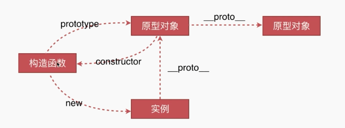

# 原型链类

### 创建对象有几种方法

```
【字面量，或Object构造函数】
var o1 = { name: "o1" };
var o2 = new Object({ name: 'o2' });

【构造函数】
function M() {
  this.name = 'o3'
}
var o3 = new M();

【将传入的对象进行原型对象的挂载】
var o4 = Object.create({ name: "o4" });
```

### 原型、构造函数、实例、原型链



------------------------

### 查看类型

```
toString.call(App)  [object Function]

Object instanceof Function  == true

typeof(fn_1)  function
typeof("")    string
typeof(0)     number
typeof([])
typeof({})
typeof(new Date())    object

prototype/__proto__
```

### instanceof原理

* 就是前面的对象是否继承后面的对象的原型，哪怕是多层。
* 内部原理就是找对象的__proto__的地址和后面的对象的prototype或__proto__的地址是一样的。

### call实现原理

* 最后效果，就是obj的属性被执行了，obj有新挂了新的FN的内部属性；
```
function FN() {
  this.a =1;
  console.log(this.b)
}
var obj = {b:10};


FN.call(obj); //10
console.log(obj); //{a:1}
------------------------------------
【实现过程】
function _call(fn, obj) {
  【1】把obj的属性挂载到fn.prototype上面；
  for(var key in obj){
    fn.prototype[key] = obj[key];
  }
  【2】实例化fn,会把后面的对象属性或方法用来执行
  var fn_obj = new fn();
  
  【3】只是把实例化后的对象的属性,再次挂载到obj上(这个过程这样写不对，因为fn_obj不一定是对象)
  for(var _key in fn_obj){
    obj[_key] = fn_obj[_key];
  }
}

_call(FN,obj)   //10
console.log(obj); //{a:1}
```
* 总的过程：obj把属性先挂到FN的this上，然后执行FN，最后把FN构造函数的内部的属性挂载到obj上，没有FN的原型对象上的属性，只是FN内的属性。

### apply, call和bind有什么区别?

* 都是把前面的函数内对象属性复制到后面的对象上。
* apply,call是直接执行函数调用，apply和call的区别是apply接受数组作为参数，而call是接受逗号分隔的无限多个参数列表；
* bind是绑定，执行需要再次调用

--------------------------------

### this到底是什么

* 构造函数：是指以后的实例对象，不是构造函数本省；当前执行对象。执行上下文；

### new实现原理

* 改变this指向。
* 原理：
```
1.一个对象被创建
2.执行后面的构造函数，把构造函数的内部的属性挂载在当前这个对象上。其实就是改变构造函数的this指向，并执行构造函数。call
3.构造函数执行后会返回一个对象或者没有。如果有，那么这个对象就代替我们一开始的对象而return输出。如果没有，就return出我们创建的那个对象。

var new2 = function(Func) {
  1.创建个对象，把Func.prototype这个对象，作为原型对象进行挂载到新对象上的__proyo__
  var obj = Object.create(Func.prototype);

  2.改变Func内部属性指向到obj，这个时候其实obj就是Func的实例了。并执行函数
  var func_obj = Func.call(obj);

  3.判断回来的是不是对象，是就输出
  if (typeof func_obj == 'object') {
    return func_obj;
  }

  4.返回我们的实例
  return obj;
}
```


