## navigationBar在哪配置？配置了个啥？

* app.json中配置；顶部栏（背景色、名字、名字）

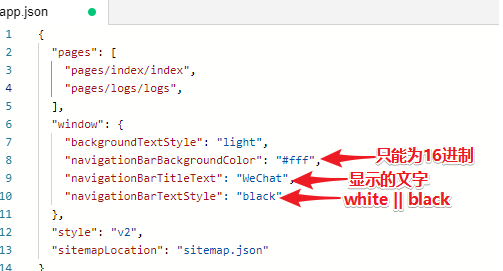

## tabBar是什么？/  list字段中每一项都是什么？

* tab栏；（导航栏，项：设置每一个功能）
* ist字段：配置每一项；
  * text：选项文字
  * iconPath：图标路径，相对路径
  * selectedIconPath: 当前选择项的图标路径
  * pagePath：选项卡点击后的页面地址；


## 如何理解小程序rpx单位？实际开发中有什么要求？

* rpx：不同的手机屏幕下，代表的px值；自动识别手机的；
* 要求：UI给我们的页面750px的设计稿，然后写页面 测量360px，在小程序里面写360rpx;


## 小程序预览需要设置什么？

* 图片，打包后超过2M
* 本地图片：开始的时候帮助我们搭建静态页；
* 地址：
  * 项目中图片，字体文件，后台请求回来的网络地址；
  * tabBar图片不能上传；本地地址支持；
* 预览：设置一个忽略！

- **打包的设置：packOptions：打包设置  ignore：忽略打包编译项目：**

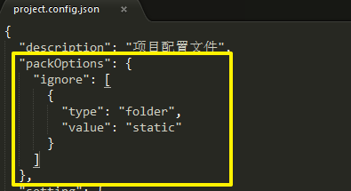

- 文档：


- 找到：packOptions /ignore

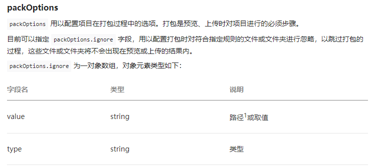


## 如何设置为体验版本？

* 为什么设置体验版？
  * 开发人员
  * 测试人员；
* 测试人员：看到我们现在写的项目；
* 成员管理：体验成员管理；
* 代码:
  * 上传到微信小程序后台管理平台；
  * 版本管理：设置为体验版本！


## 小程序V2样式有什么问题么？

* 问题：
  * 按钮：默认宽度；
  * 自己设置又设置了一个宽度；
* 发现：
  * 现在自己定义这个宽度在调试窗口已经生效；原来的默认宽度被覆盖！
  * 在显示界面：宽度还是 默认宽度；
  * CSS权重问题！
* 思考:
  * 忘记不使用v2
  * 发现你的布局样式有问题，是不是V2问题？


## 小程序 `wx:for="item in list"`这样对么？设置唯一标示如何设置？

* vue写法：`v-for="item in list"`
* 正确：`wx:for={{list}}`：注意{{}}
* 唯一标示：
  * 用数据的index,ID
  * `wx:key="*this"`：找不到唯一标示；


## 多个标签被同时循环或者被判断if ，应该如何设置？

* wx:if
* 组件：<block>  ：
  * 被同时循环或者被判断if的组件，包起来！
  * 在block上写wx语法；


## 原生小程序的事件回调函数可以传入参数么？如何设置获取组件上自定义属性？

* 不能传入参数：语法设置不能传入；
* 自定义数据：
  * 如何设置：`data-xxxx`
  * 获取：事件执行的回调，需要事件对象；`e.target.dataset`获取自定义属性的（键值对）
  * 意思：**相当于是我们给组件通过另外的形式传入 参数**


## 小程序更新数据，使用哪个方法？

* `this.setData({要更新的数据})`

  


## 请求是哪个方法？上线后如何配置？本地开发时如何配置？

* `wx.request();`
* 平台：配置 request合法域名请求；


* 本地开发：IDE测试的时候，

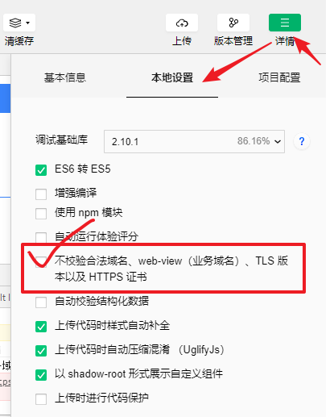


## 事件执行的三个阶段？为什么要阻止冒泡？

* 事件执行三个阶段：捕获、达到目标、冒泡阶段；
* 事件默认是在冒泡阶段执行；
  * 不阻止：
    * 子组件注册了tap事件
    * 父级注册了tap事件
    * 当我们触发子级，父级也会跟着触发；
      * 用户知道自己点对了：点的就是子级
      * 父级跟着触发的这个情况：**给用户体验不好**，阻止冒泡！

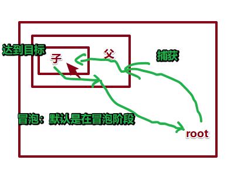


## 小程序场景值：打开方式有什么用处？小程序场景值在哪获取？

* 打开方式：扫一扫、搜索、转发；哪种统计次数更多的话，调整公司策略；

* onLaunch() : 

  * 事件对象获取场景值；
  * 打开方式业务在onLaunch写；单独写函数；在onLaunch调用；

  

  


## 页面地址的参数如何传递？如何获取？

* 小程序有很多页面；
* ugo：分类商品。点击每个商品的时候，进入一个详情页（同一个页面，不同的数据）；

* 传递：`pages/detail/index?name=zs&age=18 `
* 获取：
  * 页面`onLoad(e){}`事件对象可以获取 页面传递的参数；
  * 接下来：请求数据，返回这个查询的数据，渲染；


## 小程序 模块化有几种方式？

* 第三方包：npm包；用别人写好的东西；

* 入口主文件 app.js

  * 其他页面使用：`getApp()`推荐！
  *  app.js 里面写什么：

  

  - 在任何页面的JS中使用：

  

* 自己写：共享数据和方法；

  * js文件
  * `通过 module.exports 或 exports 对外暴露接口 `
  * 其他页面`require（../../xx/xx/xx）`

  


## 小程序npm模块如何配置和使用？

* 第三方包：npm包；用别人写好的东西；

* 封装比较好，功能丰富！

* 项目的目录下：

  * `npm  init --yes`

  * `npm i xxx -S`

  * 点击  **微信开发工具 / 工具 / 构建npm**

    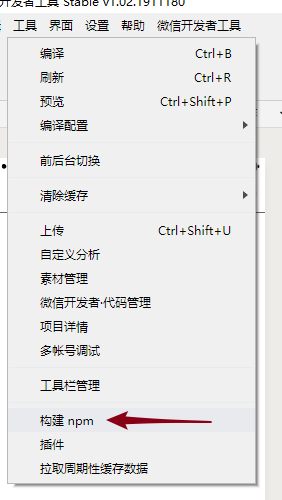

  * **详情  /  本地设置**：使用npm模块

    

  * 测试：

    

* 了解：小程序寻找包的规则：在JS页面中使用`require`
  - 优先：寻找`miniprogram_npm`下的包
  - 如果没有，则找当前路径下，有没有这个名字的JS文件
  - 如果没有，则页面报错找不到；


## wxs在渲染层起到什么作用？

* 小程序：
  * 渲染层 + JS逻辑层:  没有直接的关联；
* 需求：页面数据 返回的 时间戳 ；需要转换为 时间格式
* JS逻辑层：处理时间戳，有可能会改变源数据；
* 想要：时间格式能显示，又不改变源数据！
* 渲染层：**wxml wxss wxs:(可以理解微信自己的特有的为HTML CSS  JS )**
* wxml:
  * {{change(time)}}  
    * 如果change是真实页面下 JS内一个方法；不生效！
    * change可以设置为 wxs下一个方法：可以使用{{change(time)}}  
* 思考：**wxs当做：vue中常说 filter 过滤器；**


## 通信的思考：数据共享!!!

* 组件：
  * 父子组件！
  * 组件之间如何通信？

* 子组件：设置自定义属性：
  * **自己笔记：理解写下来！**

- 思考：
  - **兄弟组件之间如何通信？getApp();**
  - 背后：为了共享一些数据：
  - vue:共享数据；
    - eventbus
    - 找个自己写的公共的JS文件；
    - localStorage
- 新的语法：
  - 语法，思考语法能帮助实现啥？
  - **写例子：todoList(增 删 改 查)**     http://www.todolist.cn/


## 通信：父给子传递数据，子组件需要设置什么？

* 子级：接受数据，设置属性：

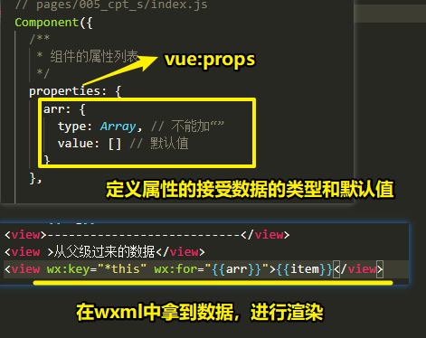

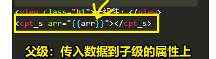

* 本地储存：wx.setStorageSync();


## 组件通信：子给父传递数据，子组件需要设置什么？

* 理解：子组件自定义事件名称，及要发送数据；
* 语法：

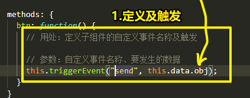

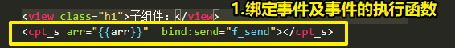


## 表单：如何获取输入框的数据？如何获取单/多选择框的数据？!!!

* 表单输入类：

  * form：
    * form本身 绑定事件submit事件 
    * form 下面按钮：`form-type`

  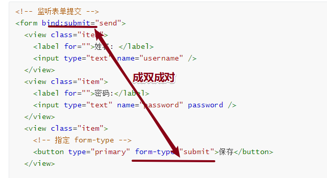

  * 获取表单数据：
    * input 组件  name属性
    * 在submit回调函数 的事件 对象里获取；`ev.detail.value`


* 单/多选择：
  * 单/多选择组 （组件）绑定 change 事件
  * change 事件回调函数 拿到单多选的数据；
  * 拿到数据通过 this.setData（）设置到初始化数据中
  * 在form 的submit 事件的回调函数内可以拿到数据:

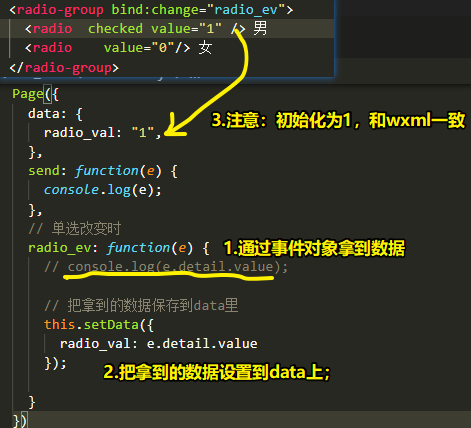


## ugo主页搜索组件覆盖整个页面，主页页面的滚动条，如何解决没有滚动条？

* 问题：

  * 搜索是按照一个组件的形式；页面中一个标签！
  * 布局：把整个页面覆盖住，主页上组件大多了；会出现滚动条！

  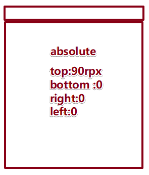

* 解决过程：

  * 搜索组件处于聚焦状态的时候，
  * 获取下窗口显示的高度，
  * 通过父子组件通信：把获取的高度传递回去；
  * 父级页面中可以获取高度H！
  * 设置页面高pageH度为  H；样式上：设置溢出隐藏！


* 其他思路：
  * 主页上搜索的地方放入组件input；注册事件；点击；
  * 触发事件后：转跳另外一个页面；
  * 可以规避滚动条问题！
  * 体验不如上一个：转跳的时候会有短暂的白页面！


## 下拉刷新需要配置么，接下来的业务是什么，如何实现？

* 配置：

  * 需要配置；

    * 原生：index.json
    * uni: pages.json

    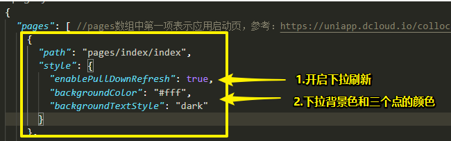

  * 在哪？订单页，支付页，商品分类页！！页面下JSON文件；每一个小程序页面也可以使用 `.json` 文件

  ```
  enablePullDownRefresh:true
  ```

  * 开启：效果！！！

* 业务：

  * 用户：下拉是个行为；
  * 函数：响应这个行为；生命周期（函数）！

  ```js
  Page({
      onPullDownRefresh(){ 所有数据进行重新请求一次}
  })
  ```

  * 请求：异步

    * uni-app：async await;

    * 原生开发：所有的异步都完成后，结束下拉效果；

      * **封装promise；**

      * promise.all[].then(function(结束下拉效果))

        

* 回访：
  * 工作：目标就是代码！有优化方案！没有什么不好意思！
  * 学习过来！写代码慢慢在进步，到了业务环境，未来的某个点，吸收知识！
  * 棒棒！按照自己有计划！不要在乎别人任何说法！


## 多次触底多次加载，如何解决这个问题？

* 解决1：

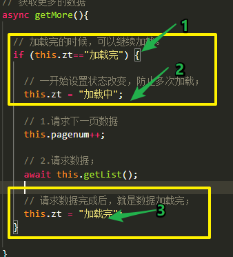

* 解决2：
  * 请求插件封装！
  * 优化：loading层加载（api：设置mask 遮罩！透明黑色层，用户防止用户再次触发屏幕！)


## 什么是区域滚动和页面滚动？区域滚动的应用场景有哪些？

* 小程序：页面滚动

  * 区域滚动：组件内可以形成一个滚动；特有的组件 <scroll-view>

  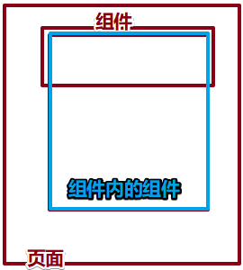

* 通过css：overflow属性，bug：当你滑动屏幕的时候，不知道大家要让哪个部分滑动；

* 区域滚动的应用场景有哪些？

  * 横向很长导航栏；

  

  * ugo：搜索确认栏布局

  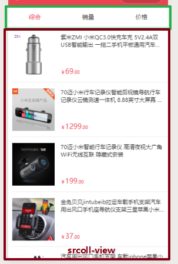

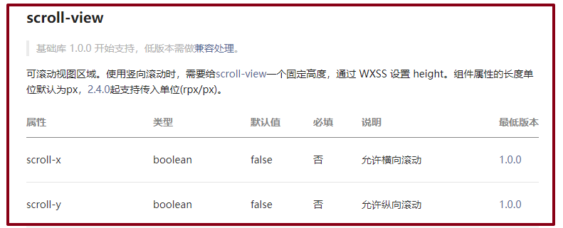


## 路由：转跳到非tabBar页的方式有哪几种？转跳到tabBar页的方式有哪几种？

* API文档上有！

* 转跳到 非tabBar

  * 组件：`<navigator url="/pages/goods/index">`
  * JS：

  ```js
  wx.navigateTo({
      url:"/pages/goods/index"
  }) 
  ```

* 转跳到 tabBar

  * 组件：`<navigator url="/pages/goods/index" open-type="switchTab">`
  * JS：

  ```
  wx.switchTab({
  	url:"/pages/goods/index"
  });
  ```

* 回到上一页：`wx.navigateBack()`

  


## 小程序的页面默认支持转发么？如何配置自定义转发？

* 页面：广告页！订单页，个人用户信息页！默认不支持；

* 开启：

  * 配置：`uni.showShareMenu();`  只是开启，不是自定义；（低配版）
  * **自定义转化**：默认转发的时候，样子太丑，用户不敢点击，页面的一个生命周期函数；需要返回一个对象，包括下面：（美化版）
    * 转化的标题
    * 图片（经过设计的图片）
    * 链接地址；

  ```
  onShareAppMessage () {
      return {
          title: '欢迎使用UGO!',
          imageUrl: 'http://www.999zx.cn/adm_file/fck/images/2018/4/Image/20184386447866.jpg',
          path: '/pages/index/index'
      }
  }
  ```

  


## 获取用户隐私信息使用哪个组件和属性设置？获取非隐私信息使用哪个组件？

* **用户隐私：需要让用户自己点；**  `<button open-type>`

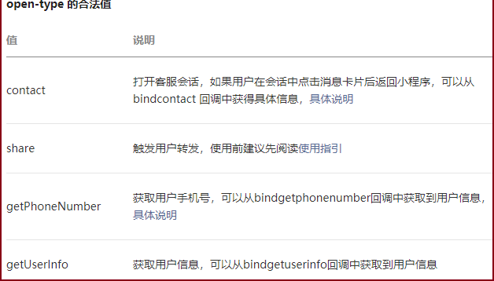

* 非隐私信息：头像，昵称，性别，国际，语言！type有属性值：


## ugo购物车结算前，需要做什么验证？

* 三个验证：

  * 收货地址：
  * 结算商品：
  * token：当前谁要买这个商品的这个用户 ，标识加密字符串的标识；
    * 没有token：token获取流程；用户登录获取token的整个流程？

  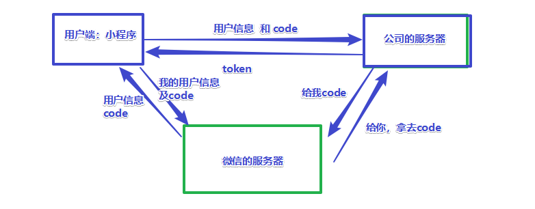

* code ：
  * 为了安全！
  * 如果token泄露了，其他人拿到 A君的token ，结算！
  * 有个平台小额免密支付：用该用户的A君 token 支付；


## 组件web-view有啥作用？

* web-view：src：引入外面域名地址；
* 可以通过小程序直接内引入 已经写好的HTML5移动端页面；
* 个人不支持：web-view
* 好处：应急！HTML5网页；
* 开发的时候：配置


## 什么是微信网页？有什么特别的地方？

* 面试：公众号开发！前端！
* 微信网页：HTNL CSS JS移动端页面
* 特别的地方：
  * 没有什么特别地方：本身来说，就是HTML页面放入公众号了；
  * 特别地方：
    * 放入公众号，可以用一些微信特别的功能；JS-SDK
    * 拍照、录音等！
* 思路：
  * 过去：没有小程序，网页有些特别的功能，JS-SDK JS包；
  * 现在：小程序，提供了非常丰富的API；


## 使用JS-SDK的获取验证的整个流程？（从前到后）

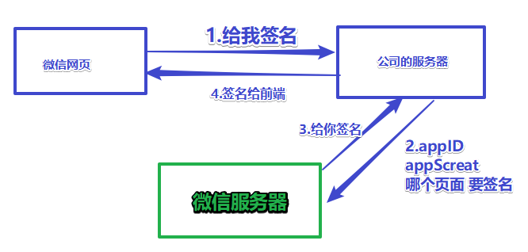

* 验证：

```js
wx.config({
  debug: true, // 开启调试模式,调用的所有api的返回值会在客户端alert出来，若要查看传入的参数，可以在pc端打开，参数信息会通过log打出，仅在pc端时才会打印。
  appId: '', // 必填，公众号的唯一标识
  timestamp: , // 必填，生成签名的时间戳
  nonceStr: '', // 必填，生成签名的随机串
  signature: '',// 必填，签名
  jsApiList: [] // 必填，需要使用的JS接口列表
});
```

* 使用：

```js
wx.ready(function(){

})
```


## `{"errMsg"chooselmage:fail, permission value is offline verifying"}` 这个报错是什么意思？

* 用的这个API方法没有登记；
* 在哪登记？ config方法下面 **jsApiList** ：["chooselmage"]


## WeUI是什么？可以在非微信网页使用么？

* CSS样式库；微信团队已经写好的CSS样式；
* 非微信网页使用：当然可以！！！
* 移动端：样式像微信；WeUI


